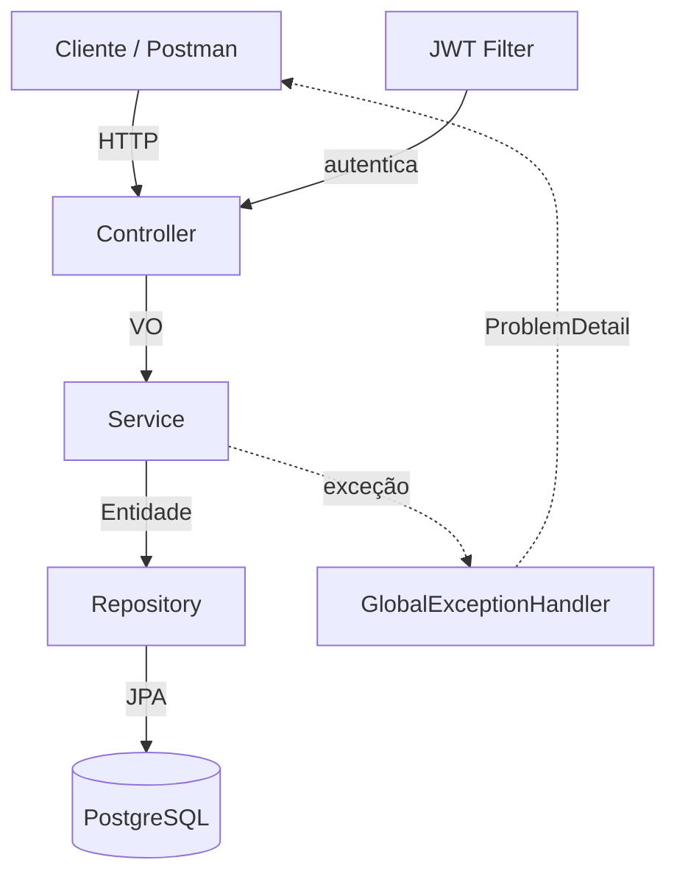
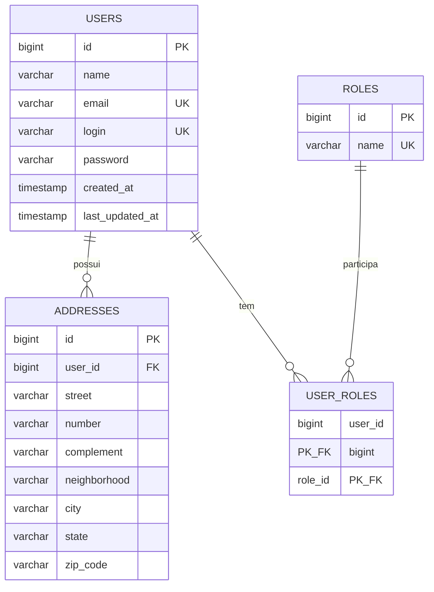

# Relatório Técnico — Tech Challenge Fase 1
## Sistema de Gestão de Restaurantes

**Alunos:**
- Mauricio Borges Florencio
- Felipe Dias Mac Dowell

**Curso:** Pós-Tech — Arquitetura e Desenvolvimento Java
**Stack:** Java 21 · Spring Boot 3.5.x · PostgreSQL · Docker
**Versão do relatório:** 1.1

> Documento vivo, organizado pelas etapas de desenvolvimento. Cada etapa do Sumário de
> Progresso abaixo corresponde a uma seção homônima neste relatório.

---

## Sumário de Progresso

| # | Etapa | Status |
|---|-------|--------|
| 1 | Setup do Projeto | ✅ |
| 2 | Modelagem das Entidades e Banco de Dados | ✅ |
| 3 | Migrations e Seeds (Flyway) | ✅ |
| 4 | Repositories | ✅ |
| 5 | Value Objects e Validação | ✅ |
| 6 | Login, Security e JWT | ✅ |
| 7 | Services (regras de negócio) | ✅ |
| 8 | Controllers Versionados (Endpoints) | ✅ |
| 9 | Tratamento de Erros (ProblemDetail) | ✅ |
| 10 | Documentação Swagger | ✅ |
| 11 | Execução com Docker Compose | ✅ |
| 12 | Testes (JUnit + Mockito + ArchUnit) | ✅ |
| 13 | Entregáveis (Postman, README) | ✅ |

**Progresso:** 13 de 13 etapas concluídas. 🎉
**Legenda:** ✅ concluída · 🔄 em andamento · ⏳ pendente.

---

## Mapa dos Entregáveis Obrigatórios

Localização de cada item exigido no enunciado do Tech Challenge dentro deste relatório:

| Entregável obrigatório | Onde encontrar |
|------------------------|----------------|
| Descrição detalhada da arquitetura | Visão Geral da Arquitetura |
| Modelagem das entidades e relacionamentos | Etapa 2 |
| Estrutura do banco de dados (tabelas) | Etapa 2 |
| Descrição dos endpoints (com exemplos) | Etapas 6 e 8 |
| Documentação Swagger | Etapa 10 |
| Coleção Postman | Etapa 13 |
| Passo a passo com Docker Compose | Etapa 11 |

---

## Visão Geral da Arquitetura

### Padrão arquitetural adotado

A aplicação adota uma **Arquitetura em Camadas (Layered Architecture)**, organizada em
quatro camadas principais com responsabilidades bem definidas, somadas a componentes
transversais (configuração, segurança e tratamento de erros).

A escolha por arquitetura em camadas — em vez de Hexagonal ou Clean Architecture — se
justifica pelo escopo da Fase 1: um backend de gestão de usuários com regras de negócio
diretas. A arquitetura em camadas entrega a separação de responsabilidades exigida pelos
princípios SOLID com baixa complexidade acidental, mantendo o código legível, testável e
de fácil evolução para as próximas fases.

### Camadas

| Camada | Pacote | Responsabilidade |
|--------|--------|------------------|
| Apresentação (API) | `controller` | Expõe os endpoints REST versionados, recebe/retorna VOs, delega para os Services. Não contém regra de negócio. |
| Negócio (Aplicação) | `service` | Concentra as regras de negócio: unicidade de e-mail, registro da data de alteração, validação de login, troca de senha, busca por nome. |
| Persistência | `repository` | Abstrai o acesso ao banco via Spring Data JPA. |
| Domínio | `entity`, `enums` | Modelo de domínio (entidades JPA e papéis). |

### Componentes transversais

| Componente | Pacote | Responsabilidade |
|------------|--------|------------------|
| VOs | `vo` | Contratos de entrada e saída da API, desacoplados das entidades. |
| Tratamento de erros | `exception` | Handler global que padroniza respostas de erro no formato ProblemDetail (RFC 7807). |
| Segurança | `security` | Filtro de autenticação JWT e utilitários de token. |
| Configuração | `config` | Configuração do Spring Security e do OpenAPI/Swagger. |
| Utilitários | `util` | Funções transversais (normalização de texto, verificações). |

### Fluxo de uma requisição

```
Cliente HTTP
    │
    ▼
[Controller]  ──valida VO de entrada──►  [Service]  ──regras de negócio──►  [Repository]
    ▲                                          │                                   │
    │                                          ▼                                   ▼
    └──────────  VO de saída  ◄────── mapeamento ◄────── Entidade ◄──────────  PostgreSQL
```

Em caso de erro em qualquer ponto, a exceção é capturada pelo handler global e convertida
em uma resposta padronizada `ProblemDetail`.

### Diagrama de componentes (Mermaid)



---

## Etapa 1 — Setup do Projeto

### Stack e dependências

| Tecnologia | Versão | Uso |
|------------|--------|-----|
| Java | 21 (LTS) | Linguagem |
| Spring Boot | 3.5.x | Framework base |
| Spring Web | (gerenciado) | API REST |
| Spring Data JPA | (gerenciado) | Persistência |
| Spring Validation | (gerenciado) | Validação de VOs |
| Spring Security | (gerenciado) | Autenticação JWT |
| PostgreSQL | 16 | Banco relacional |
| springdoc-openapi | 2.8.x | Documentação Swagger |
| jjwt | 0.12.x | Geração/validação de JWT |
| Flyway | (gerenciado) | Migração e versionamento de schema |
| Spring HATEOAS | (gerenciado) | Links de navegação nas respostas REST |
| Spring Boot Actuator | (gerenciado) | Observabilidade (health, info, metrics) |
| MapStruct | 1.6.x | Mapeamento VO ↔ entidade (geração em compilação) |
| Lombok | (gerenciado) | Redução de boilerplate |
| JUnit 5 + Mockito | (gerenciado) | Testes |
| ArchUnit | 1.4.x | Testes automatizados de regras de arquitetura |

### Estrutura de pacotes

Raiz: `com.postech.restaurantes`

```
src/main/java/com/postech/restaurantes/
├── RestaurantesApplication.java
├── config/
├── controller/
├── entity/             # User, Role, Address
├── enums/              # RoleName
├── exception/
├── mapper/             # mapeadores MapStruct (VO ↔ entidade)
├── repository/
├── security/
├── service/
├── util/               # TextUtils, ObjectUtils (funções transversais)
└── vo/                 # Value Objects (records imutáveis)
    ├── shared/         # VOs de valor estáveis: Email, ZipCode
    └── v1/             # VOs de contrato, versionados junto com a API
        ├── request/    # VOs de entrada (sufixo Request)
        └── response/   # VOs de saída (sufixo Response)
```

---

## Etapa 2 — Modelagem das Entidades e Banco de Dados

### Abordagem de projeto

O modelo foi construído seguindo a divisão clássica de projeto de banco de dados em
três níveis — conceitual, lógico e físico (Machado) — e os princípios do modelo
relacional, normalização e integridade referencial (Date). O objetivo foi um esquema
**normalizado até a 3ª Forma Normal / BCNF**, já preparado para autenticação e
autorização com Spring Security.

### Tabelas do modelo

| Tabela | Tipo | Responsabilidade |
|--------|------|------------------|
| `users` | Entidade forte | Identidade e credenciais do usuário |
| `roles` | Entidade forte (lookup) | Papéis de autorização |
| `user_roles` | Tabela associativa | Resolve o N:M entre usuários e papéis |
| `addresses` | Entidade | Endereços do usuário (1:N) |

### Relacionamentos e cardinalidade

| Relacionamento | Cardinalidade | Implementação |
|----------------|---------------|---------------|
| `users` ↔ `addresses` | 1 : N | FK `addresses.user_id` (`@OneToMany`/`@ManyToOne`) |
| `users` ↔ `roles` | N : M | Tabela `user_roles` (`@ManyToMany` + `@JoinTable`) |

Regras de integridade referencial: `addresses.user_id` e as FKs de `user_roles` usam
`ON DELETE CASCADE` — remover um usuário remove seus endereços e seus vínculos de papel,
sem deixar registros órfãos.

### Justificativa da normalização

- **1FN (atomicidade, sem grupos repetitivos):** papéis e endereços foram extraídos para
  tabelas próprias. Mantê-los como colunas em `users` (ex.: `papel1`, `papel2`,
  `endereco1`...) violaria a 1FN. A associativa `user_roles` e a tabela `addresses`
  eliminam os grupos repetitivos.
- **2FN (sem dependência parcial):** a única chave composta é a de `user_roles`
  (`user_id`, `role_id`), que não possui atributos não-chave dependentes de parte da chave.
- **3FN (sem dependência transitiva):** em `users`, todo atributo depende apenas da PK.
  O nome do papel reside em `roles`, evitando repetir o texto do papel em cada vínculo.
- **BCNF:** `email` e `login` são chaves candidatas (únicas) de `users`; todo determinante
  é uma chave candidata.

### Decisão: papéis como tabela (não enum)

Os dois tipos de usuário exigidos (Dono de restaurante e Cliente) foram modelados como
**papéis** (`ROLE_OWNER`, `ROLE_CUSTOMER`), persistidos na tabela `roles` e vinculados ao
usuário via `user_roles`. Essa escolha:

1. Atende ao requisito de "tabela de ROLE para controle dos papéis".
2. É exatamente a estrutura que o Spring Security consome para montar as autoridades
   (`GrantedAuthority`).
3. Permite que um usuário acumule papéis (ex.: um dono que também é cliente) sem alteração
   de schema, diferentemente de um enum de coluna única.

### Data de criação e última alteração

A entidade `User` registra `created_at` (imutável) e `last_updated_at`, ambos preenchidos
por *callbacks* de ciclo de vida do JPA: `@PrePersist` define os dois na criação e
`@PreUpdate` atualiza `last_updated_at` em qualquer modificação — atendendo ao requisito
"registro da data da última alteração". Tipo usado: `LocalDateTime` (API moderna de
data/hora do Java, em vez do legado `java.util.Date`).

### Diagrama Entidade-Relacionamento



### Estrutura do banco de dados (tabelas)

O schema é **gerenciado pelo Flyway** através de migrations SQL versionadas em
`src/main/resources/db/migration` (a primeira é `V1__create_initial_schema.sql`). O
Hibernate opera em modo `validate`: ele não altera o banco, apenas confere que as
entidades batem com o schema criado pelas migrations. Cada mudança futura entra como uma
nova migration (`V2`, `V3`...), nunca por alteração automática. DDL da migration inicial:

```sql
CREATE TABLE users (
    id              BIGINT GENERATED ALWAYS AS IDENTITY PRIMARY KEY,
    name            VARCHAR(255) NOT NULL,
    email           VARCHAR(255) NOT NULL UNIQUE,
    login           VARCHAR(255) NOT NULL UNIQUE,
    password        VARCHAR(255) NOT NULL,
    created_at      TIMESTAMP    NOT NULL,
    last_updated_at TIMESTAMP    NOT NULL
);

CREATE TABLE roles (
    id   BIGINT GENERATED ALWAYS AS IDENTITY PRIMARY KEY,
    name VARCHAR(50) NOT NULL UNIQUE  -- ROLE_OWNER, ROLE_CUSTOMER, ROLE_ADMIN
);

CREATE TABLE user_roles (
    user_id BIGINT NOT NULL REFERENCES users (id) ON DELETE CASCADE,
    role_id BIGINT NOT NULL REFERENCES roles (id) ON DELETE CASCADE,
    PRIMARY KEY (user_id, role_id)
);

CREATE TABLE addresses (
    id           BIGINT GENERATED ALWAYS AS IDENTITY PRIMARY KEY,
    user_id      BIGINT       NOT NULL REFERENCES users (id) ON DELETE CASCADE,
    street       VARCHAR(255) NOT NULL,
    number       VARCHAR(255),
    complement   VARCHAR(255),
    neighborhood VARCHAR(255),
    city         VARCHAR(255) NOT NULL,
    state        VARCHAR(2)   NOT NULL,
    zip_code     VARCHAR(9)   NOT NULL
);
```

---

## Etapa 3 — Migrations e Seeds (Flyway)

O versionamento do banco é feito com **Flyway**: o schema e os dados iniciais são definidos
por scripts SQL versionados, aplicados automaticamente na inicialização da aplicação. O
Hibernate roda em `ddl-auto: validate` — não altera o banco, apenas confere que as
entidades batem com o schema criado pelas migrations.

### Convenção e localização

- Local: `src/main/resources/db/migration`.
- Nomenclatura: `V<versão>__<descrição>.sql` (dois underscores). Ex.: `V1__create_initial_schema.sql`.
- A ordem de aplicação segue o número da versão.

### Migrations do projeto

| Versão | Arquivo | Conteúdo |
|--------|---------|----------|
| V1 | `V1__create_initial_schema.sql` | DDL das tabelas (`users`, `roles`, `user_roles`, `addresses`) + **seed dos papéis** (`ROLE_OWNER`, `ROLE_CUSTOMER`, `ROLE_ADMIN`) |
| V2 | `V2__seed_demo_users.sql` | **Seed de usuários de demonstração**: um dono e um cliente, com papéis e endereços |
| V3 | `V3__seed_admin_user.sql` | **Seed do usuário administrador** (`ROLE_ADMIN`), usado nos cenários de escopo administrativo |

### Seeds

- **Papéis (V1):** dados de referência essenciais — sem eles, nenhum usuário pode ser
  criado (todo usuário precisa de pelo menos um papel).
- **Usuários de demonstração (V2):** permitem testar o login imediatamente após subir a
  aplicação. As senhas estão em **hash BCrypt** (mesmo algoritmo do `BCryptPasswordEncoder`):

  | Login | Senha | Papel |
  |-------|-------|-------|
  | `dono.restaurante` | `dono12345` | `ROLE_OWNER` |
  | `cliente.demo` | `cliente12345` | `ROLE_CUSTOMER` |
  | `admin.demo` | `admin12345` | `ROLE_ADMIN` |

  > Os seeds de demonstração são apenas para teste; remova-os antes de um ambiente real.
  > O `admin.demo` (V3) existe porque `ROLE_ADMIN` **não** pode ser obtido pelo autocadastro
  > público (ver Etapas 6 e 7) — é a via legítima de criar um administrador nesta fase.

### Regras de uso do Flyway

- **Migrations aplicadas são imutáveis.** O Flyway grava um *checksum* de cada script na
  tabela `flyway_schema_history`; alterar um script já aplicado quebra a validação. Toda
  mudança no banco entra como uma **nova** migration (`V3`, `V4`...).
- **Como criar uma nova migration:** adicione um arquivo `V<n>__descricao.sql` em
  `db/migration` com o próximo número e suba a aplicação — o Flyway aplica o que ainda não
  foi executado.
- **Histórico:** a tabela `flyway_schema_history` registra o que já foi aplicado, quando e
  com qual checksum.

---

## Etapa 4 — Repositories

Acesso a dados via Spring Data JPA (interfaces com *query methods* derivados, sem SQL
manual):

| Repository | Métodos | Atende ao requisito |
|------------|---------|---------------------|
| `UserRepository` | `existsByEmail`, `existsByLogin` | Unicidade de e-mail e login |
| | `findByLogin` | Validação de login / autenticação |
| | `findByNameContainingIgnoreCase` | Busca de usuários pelo nome |
| `RoleRepository` | `findByName` | Resolução das entidades de papel |

Endereços não possuem repository próprio: são gerenciados pelo agregado `User` (cascade e
`orphanRemoval`).

---

## Etapa 5 — Value Objects e Validação

Por decisão de projeto, **todos os objetos de transferência da API são Value Objects**
(`record` imutáveis), aproveitando a imutabilidade e a igualdade por valor do `record` do
Java 21. O projeto não utiliza a nomenclatura de objeto de transferência tradicional.

### Estratégia de validação

Os VOs de entrada validam com **Bean Validation** (`@NotBlank`, `@Email`, `@Size`,
`@Pattern`), o que permite validação agregada (todos os erros de uma vez) e documentação
automática no Swagger. Os **VOs de valor** (`Email`, `ZipCode`) atuam no domínio, no
Service: além de revalidar, **normalizam** os dados — o `Email` para minúsculas (o que
torna a regra de e-mail único correta, evitando que `A@b.com` e `a@b.com` sejam tratados
como distintos) e o `ZipCode` para os 8 dígitos.

### Classes utilitárias (`util`)

| Classe | Responsabilidade |
|--------|------------------|
| `TextUtils` | normalização de texto: trim, minúsculas, remoção de acentos, só dígitos |
| `ObjectUtils` | verificações de presença: `isBlank`, `isEmpty`, `requireNonNull`, `requireNonBlank` |

### VOs de valor (`vo/shared`)

| VO | Invariante |
|----|------------|
| `Email` | formato válido; normalizado para minúsculas |
| `ZipCode` | 8 dígitos; formatação `00000-000` sob demanda |

### VOs de contrato (`vo/v1`)

**Entrada** (`vo/v1/request`, sufixo `Request`): `UserRegistrationRequest`,
`UserUpdateRequest` (sem senha), `PasswordChangeRequest`, `LoginRequest`, `AddressRequest`.

**Saída** (`vo/v1/response`, sufixo `Response`): `UserResponse` (nunca expõe senha),
`AddressResponse`, `RoleResponse`, `AuthResponse` (token JWT + expiração).

### Versionamento dos VOs

Os VOs de contrato vivem sob `vo/v1`, acompanhando a versão da API (`/api/v1`). Uma futura
`v2` ganha `vo/v2/...` sem quebrar os clientes da `v1`. Os VOs de valor (`Email`,
`ZipCode`) ficam em `vo/shared` por serem conceitos de domínio estáveis.

### Mapeadores (`mapper`, MapStruct)

| Mapeador | Converte |
|----------|----------|
| `UserMapper` | `User` ↔ `UserRegistrationRequest` / `UserResponse` |
| `AddressMapper` | `Address` ↔ `AddressRequest` / `AddressResponse` |

Gerados em tempo de compilação (sem reflection), injetados como beans Spring. Senha e
papéis ficam como `ignore` no mapeamento de entrada — são resolvidos no Service (hash da
senha e busca das entidades `Role`). Um `@AfterMapping` mantém a referência de volta dos
endereços ao usuário.

Princípio aplicado (SOLID/clean code): a entidade nunca cruza a fronteira da API. O
Controller trafega apenas VOs; o Service faz a tradução VO ↔ entidade — protegendo o
domínio, impedindo o vazamento da senha e desacoplando o contrato REST do schema.

---

## Etapa 6 — Login, Security e JWT

Autenticação com **Spring Security em modo stateless** (sem sessão no servidor) e tokens
**JWT** assinados em HMAC-SHA256. Implementa o serviço obrigatório de validação de login.

### Fluxo de autenticação

1. O `AuthController` recebe as credenciais no endpoint de login.
2. O `AuthenticationService` delega ao `AuthenticationManager`, que valida login e senha —
   a comparação senha × hash é feita com **BCrypt** via `CustomUserDetailsService`.
3. Se válido, o `JwtService` gera um token JWT assinado.
4. Nas requisições seguintes, o `JwtAuthenticationFilter` lê o cabeçalho `Bearer`, valida
   o token e popula o contexto de segurança.

### Componentes

| Classe | Pacote | Papel |
|--------|--------|-------|
| `SecurityConfig` | `config` | Filter chain, `PasswordEncoder` (BCrypt), `AuthenticationManager` |
| `JwtService` | `security` | Geração e validação de tokens JWT |
| `JwtAuthenticationFilter` | `security` | Autentica cada requisição via token Bearer |
| `CustomUserDetailsService` | `security` | Carrega o usuário e converte papéis em autoridades |
| `UserSecurity` | `security` | Suporte à autorização por posse (`isSelf`) usado no `@PreAuthorize` |
| `AuthenticationService` | `service` | Valida credenciais e emite o token |
| `AuthController` | `controller` | Endpoint de login |

### Controle de acesso

Endpoints **públicos**: login (`/api/v1/auth/**`), auto-cadastro (`POST /api/v1/users`),
Swagger e health checks. Todos os demais exigem token válido. O segredo (`JWT_SECRET`, no
mínimo 256 bits) e a expiração vêm de variáveis de ambiente.

**Autorização por posse (method security).** Além de exigir autenticação, as operações por
id (`GET/PUT/PATCH/DELETE /api/v1/users/{id}`) aplicam autorização em nível de método, com
`@EnableMethodSecurity` e `@PreAuthorize`. A regra é **dono do recurso ou administrador**:

```java
@PreAuthorize("hasRole('ADMIN') or @userSecurity.isSelf(#id, authentication)")
```

O bean `UserSecurity.isSelf(...)` resolve o usuário autenticado pelo login e compara o id
do recurso com o id do próprio usuário. Sem essa verificação, qualquer token válido poderia
ler, alterar ou excluir **qualquer** usuário (uma falha de referência direta a objeto —
*IDOR*). Um usuário comum que tente acessar o recurso de outro recebe `403`; um `ROLE_ADMIN`
acessa qualquer um. As consultas de coleção (`GET /users` e busca por nome) permanecem
disponíveis a qualquer usuário autenticado, por serem parte do requisito de busca.

**Autocadastro restrito.** O `POST /api/v1/users` é público (auto-registro) e, por isso, o
serviço **rejeita** solicitações que incluam `ROLE_ADMIN` (retorno `403`), impedindo
escalonamento de privilégio. Papéis de administrador só nascem por seed (migration V3) ou
por um fluxo autenticado. Detalhe da regra na Etapa 7.

### Endpoint de autenticação

**`POST /api/v1/auth/login`** — valida login e senha; retorna um token JWT. Público.

Requisição:
```json
{
  "login": "joao.silva",
  "password": "senhaSegura123"
}
```

Resposta `200 OK`:
```json
{
  "token": "eyJhbGciOiJIUzI1NiJ9...",
  "type": "Bearer",
  "expiresIn": 3600000
}
```

Credenciais inválidas retornam `401 Unauthorized` (padronizado como `ProblemDetail` na
Etapa 9). Para acessar endpoints protegidos, envie `Authorization: Bearer <token>`.

---

## Etapa 7 — Services (regras de negócio)

O `UserService` concentra as regras de negócio, traduzindo VOs ↔ entidades (via MapStruct)
e orquestrando repositórios, normalização e segurança. As exceções de domínio lançadas
aqui são padronizadas como `ProblemDetail` na Etapa 9.

### Operações

| Método | Regras aplicadas |
|--------|------------------|
| `register` | **Rejeita autocadastro com `ROLE_ADMIN`** (endpoint público → `ForbiddenOperationException`/403), normaliza o e-mail (VO `Email`), garante unicidade de e-mail e login, aplica **hash BCrypt** na senha, resolve os papéis (`RoleName` → entidades `Role`) e normaliza os CEPs (VO `ZipCode`). |
| `update` | Atualiza nome, e-mail e login (revalidando unicidade, ignorando o próprio registro) e substitui os endereços. **Não** altera a senha. |
| `changePassword` | Confere a senha atual (`BCrypt.matches`), valida que a nova senha e a confirmação coincidem, e grava o novo hash. |
| `delete` | Remove o usuário (e, por cascade, seus endereços e vínculos de papel). |
| `findById` / `findByName` / `findAll` | Consultas; `findByName` usa busca parcial sem diferenciar maiúsculas/minúsculas. |

### Exceções de domínio

| Exceção | Situação | HTTP (Etapa 9) |
|---------|----------|----------------|
| `ResourceNotFoundException` | usuário ou papel inexistente | 404 |
| `DuplicateResourceException` | e-mail ou login já cadastrado | 409 |
| `InvalidPasswordException` | senha atual incorreta ou confirmação divergente | 400 |
| `ForbiddenOperationException` | autocadastro solicitando papel privilegiado (`ROLE_ADMIN`) | 403 |

### Detalhe que garante o requisito de e-mail único

A unicidade do e-mail só é correta porque o VO `Email` **normaliza para minúsculas** antes
da checagem e da gravação. Sem isso, `Joao@x.com` e `joao@x.com` passariam pela verificação
como distintos e quebrariam a regra. A normalização do e-mail é, portanto, parte da regra
de negócio — não um detalhe cosmético.

---

## Etapa 8 — Controllers Versionados (Endpoints)

**Estratégia de versionamento:** versionamento por path (`/api/v1/...`), espelhado na
organização dos VOs (`vo/v1`). Permite evoluir a API para `v2` sem quebrar clientes.

### Endpoints de usuário

Todos sob `/api/v1/users`. As respostas incluem links **HATEOAS** (`self` e `users`),
montados pelo `UserModelAssembler`.

| Método | Rota | Descrição | Sucesso | Autorização |
|--------|------|-----------|---------|-------------|
| `POST` | `/api/v1/users` | Cadastro (público) | `201 Created` + `Location` | Pública (sem `ROLE_ADMIN`) |
| `GET` | `/api/v1/users/{id}` | Consulta por id | `200 OK` | Dono ou `ROLE_ADMIN` |
| `GET` | `/api/v1/users?name=...` | Busca paginada por nome (parcial) | `200 OK` | Autenticado |
| `GET` | `/api/v1/users` | Lista paginada | `200 OK` | Autenticado |
| `PUT` | `/api/v1/users/{id}` | Atualiza dados (endpoint distinto) | `200 OK` | Dono ou `ROLE_ADMIN` |
| `PATCH` | `/api/v1/users/{id}/password` | Troca de senha (endpoint exclusivo) | `204 No Content` | Dono ou `ROLE_ADMIN` |
| `DELETE` | `/api/v1/users/{id}` | Exclui | `204 No Content` | Dono ou `ROLE_ADMIN` |

#### Paginação

A listagem e a busca por nome são **paginadas** (Spring Data `Pageable`), aceitando os
parâmetros de query:

- `page` — número da página (base 0; padrão `0`);
- `size` — itens por página (padrão `20`);
- `sort` — campo e direção de ordenação (padrão `name`; ex.: `sort=name,desc`).

Exemplo: `GET /api/v1/users?page=0&size=10&sort=name,asc`. A resposta usa `PagedModel`
(HATEOAS): cada usuário vem com seus links, e o envelope traz os links de navegação
(`first`, `prev`, `next`, `last`) e o bloco `page` com os metadados:

```json
{
  "_embedded": { "userResponseList": [ /* usuários com _links */ ] },
  "_links": {
    "first": { "href": ".../api/v1/users?page=0&size=10" },
    "self":  { "href": ".../api/v1/users?page=0&size=10" },
    "next":  { "href": ".../api/v1/users?page=1&size=10" },
    "last":  { "href": ".../api/v1/users?page=4&size=10" }
  },
  "page": { "size": 10, "totalElements": 42, "totalPages": 5, "number": 0 }
}
```

**Exemplo — cadastro** (`POST /api/v1/users`):

```json
{
  "name": "João Silva",
  "email": "joao.silva@email.com",
  "login": "joao.silva",
  "password": "senhaSegura123",
  "roles": ["ROLE_CUSTOMER"],
  "addresses": [
    {
      "street": "Rua das Flores",
      "number": "100",
      "complement": "Apto 21",
      "neighborhood": "Centro",
      "city": "São Paulo",
      "state": "SP",
      "zipCode": "01001-000"
    }
  ]
}
```

Resposta `201 Created` (com links HATEOAS):

```json
{
  "id": 1,
  "name": "João Silva",
  "email": "joao.silva@email.com",
  "login": "joao.silva",
  "roles": [{ "id": 2, "name": "ROLE_CUSTOMER" }],
  "addresses": [{ "id": 1, "street": "Rua das Flores", "number": "100",
                  "complement": "Apto 21", "neighborhood": "Centro",
                  "city": "São Paulo", "state": "SP", "zipCode": "01001000" }],
  "createdAt": "2026-06-28T10:00:00",
  "lastUpdatedAt": "2026-06-28T10:00:00",
  "_links": {
    "self":  { "href": "http://localhost:8080/api/v1/users/1" },
    "users": { "href": "http://localhost:8080/api/v1/users" }
  }
}
```

**Exemplo — troca de senha** (`PATCH /api/v1/users/1/password`):

```json
{
  "currentPassword": "senhaSegura123",
  "newPassword": "novaSenha456",
  "confirmPassword": "novaSenha456"
}
```

Respostas de erro (e-mail duplicado, recurso inexistente, senha incorreta) seguem o padrão
`ProblemDetail` da Etapa 9.

---

## Etapa 9 — Tratamento de Erros (ProblemDetail)

O `GlobalExceptionHandler` (`@RestControllerAdvice`) padroniza **todas** as respostas de
erro no formato **ProblemDetail (RFC 7807)**, nativo do Spring 6, acrescentando um
`timestamp`. Um `JwtAuthenticationEntryPoint` estende esse padrão também ao 401 de acesso
sem token (que normalmente escaparia do advice).

| Exceção / situação | HTTP | Título |
|--------------------|------|--------|
| `MethodArgumentNotValidException` (Bean Validation) | 400 | Requisição inválida (com mapa `errors` por campo) |
| `IllegalArgumentException` (VOs `Email`/`ZipCode`) | 400 | Requisição inválida |
| `InvalidPasswordException` | 400 | Senha inválida |
| `AuthenticationException` (login/senha) | 401 | Falha na autenticação |
| acesso sem token (entry point) | 401 | Não autenticado |
| `ForbiddenOperationException` (papel privilegiado no autocadastro) | 403 | Operação não permitida |
| `AccessDeniedException` (recurso de outro usuário) | 403 | Acesso negado |
| `ResourceNotFoundException` | 404 | Recurso não encontrado |
| `DuplicateResourceException` | 409 | Conflito de dados |
| `Exception` (não prevista) | 500 | Erro inesperado |

Exemplo de resposta de erro de validação (`400`):

```json
{
  "type": "about:blank",
  "title": "Requisição inválida",
  "status": 400,
  "detail": "Um ou mais campos são inválidos",
  "errors": {
    "email": "E-mail inválido",
    "password": "A senha deve ter ao menos 8 caracteres"
  },
  "timestamp": "2026-06-28T10:00:00Z"
}
```

---

## Etapa 10 — Documentação Swagger

Documentação **OpenAPI** gerada automaticamente pelo springdoc a partir dos controllers e
VOs (as anotações de Bean Validation, como `@NotBlank` e `@Email`, aparecem nos schemas). A
`OpenApiConfig` registra o esquema de segurança **Bearer JWT**, habilitando o botão
**Authorize** no Swagger UI — assim é possível autenticar e testar os endpoints protegidos
direto pela interface.

- Swagger UI: `http://localhost:8080/swagger-ui.html`
- OpenAPI JSON: `http://localhost:8080/v3/api-docs`

Fluxo de uso: chamar `POST /api/v1/auth/login`, copiar o token, clicar em **Authorize**,
colar o token e executar os demais endpoints. *(Inserir aqui prints da interface na entrega.)*

---

## Etapa 11 — Execução com Docker Compose

### Pré-requisitos
- Docker e Docker Compose instalados.

### Variáveis de ambiente

O projeto usa variáveis de ambiente com valores padrão (ver `.env.example`):

| Variável | Padrão | Descrição |
|----------|--------|-----------|
| `DB_NAME` | `restaurantes-app` | Nome do banco |
| `DB_USER` | `postgres` | Usuário do banco |
| `DB_PASSWORD` | `postgres` | Senha do banco |
| `DB_HOST` | `localhost` (local) / `db` (compose) | Host do banco |
| `DB_PORT` | `5432` | Porta do banco |
| `JWT_SECRET` | *(valor de exemplo)* | Segredo de assinatura do JWT |
| `JWT_EXPIRATION` | `3600000` | Expiração do token em ms |

### Passo a passo

```bash
# 1. (Opcional) criar seu .env a partir do exemplo
cp .env.example .env

# 2. Subir apenas o banco (útil durante o desenvolvimento)
docker compose up -d db

# 3. Subir aplicação + banco juntos
docker compose up --build

# 4. Encerrar
docker compose down

# 4b. Encerrar e apagar os dados do banco
docker compose down -v
```

A aplicação ficará disponível em `http://localhost:8080`
e o Swagger em `http://localhost:8080/swagger-ui.html`.

---

## Etapa 12 — Testes (JUnit + Mockito + ArchUnit)

**Testes de arquitetura (ArchUnit) — `ArchitectureTest`.** Verificam, no build, as regras
da arquitetura em camadas: Controller → Service → Repository, controllers não acessam
repositories diretamente, entidades não dependem de VOs nem de controllers, e repositories
são interfaces. Protegem a arquitetura contra erosão.

**Testes unitários (JUnit 5 + Mockito) — `UserServiceTest`.** Cobrem as regras de negócio
do serviço de usuário, com os repositórios, o encoder e os mapeadores mockados:

- cadastro válido (verifica o hash da senha);
- cadastro solicitando `ROLE_ADMIN` → `ForbiddenOperationException` (autocadastro restrito);
- cadastro com e-mail duplicado → `DuplicateResourceException`;
- cadastro com login duplicado → `DuplicateResourceException`;
- troca de senha bem-sucedida;
- troca de senha com senha atual incorreta → `InvalidPasswordException`;
- troca de senha com confirmação divergente → `InvalidPasswordException`;
- consulta/exclusão de id inexistente → `ResourceNotFoundException`;
- busca por nome.

Execução: `mvn test`.

---

## Etapa 13 — Entregáveis (Postman, README)

### Coleção Postman

Arquivo `restaurantes/postman/Restaurantes.postman_collection.json` (formato v2.1). Usa as
variáveis `{{baseUrl}}` e `{{token}}`; o request de login tem um *script de teste* que
salva o token automaticamente na coleção. Organizada em duas pastas, cobre todos os
cenários exigidos:

**Autenticação:** login admin — salva `{{adminToken}}` · login inválido (401).

**Usuários:** cadastro válido (201, salva `{{userId}}`) · login do usuário criado (salva
`{{token}}`) · cadastro inválido por campos faltando (400) · cadastro inválido por e-mail
duplicado (409) · **cadastro solicitando `ROLE_ADMIN` → proibido (403)** · busca por nome
(200) · listar paginado (200) · busca por id do próprio usuário (200) · **busca por id de
outro usuário → negado (403)** · **busca por id via admin (200)** · atualização do próprio
(200) · atualização de inexistente via admin (404) · troca de senha do próprio com sucesso
(204) e com erro (400) · exclusão do próprio (204).

Uso: importar no Postman e executar de cima para baixo — o fluxo popula `{{adminToken}}`,
`{{userId}}` e `{{token}}` automaticamente via *scripts de teste*. Os cenários de posse
(403) e de escopo administrativo (200/404) ficam evidentes na sequência. *(Inserir prints
na entrega.)*

### README do repositório

Arquivo `restaurantes/README.md` com: stack, pré-requisitos, passo a passo de execução com
Docker Compose, variáveis de ambiente, fluxo de autenticação, tabela de endpoints, acesso
ao Swagger, uso da coleção Postman e execução dos testes.

---

## Decisões Técnicas (registro consolidado)

- **Versionamento de API:** via path (`/api/v1/...`). Detalhado na Etapa 8.
- **Padrão de erros:** ProblemDetail (RFC 7807) nativo do Spring 6+. Detalhado na Etapa 9.
- **Autenticação com Spring Security + JWT (stateless):** senha com hash BCrypt; token
  assinado em HMAC-SHA256; validação por filtro a cada requisição. Detalhado na Etapa 6.
- **Autorização por posse + autocadastro restrito:** operações por id exigem ser o dono do
  recurso ou `ROLE_ADMIN` (`@PreAuthorize` + bean `UserSecurity`), evitando *IDOR*; o
  autocadastro público não concede `ROLE_ADMIN` (evita escalonamento de privilégio).
  Detalhado nas Etapas 6 e 7.
- **Schema versionado com Flyway:** schema definido por migrations SQL; Hibernate em
  `ddl-auto: validate`. Detalhado na Etapa 3.
- **HATEOAS:** respostas REST enriquecidas com links via `EntityModel`/`CollectionModel`
  sobre os VOs (preservando a imutabilidade dos records).
- **Actuator:** endpoints de monitoramento (`health`, `info`, `metrics`) com exposição
  controlada.
- **Mapeamento de objetos (VO ↔ entidade): MapStruct.** Geração em tempo de compilação,
  suporte nativo a `records`, zero reflection. O DozerMapper foi descartado por estar
  descontinuado e ser incompatível com records imutáveis. Processadores configurados na
  ordem Lombok → `lombok-mapstruct-binding` → `mapstruct-processor`.
- **Objetos de transferência como Value Objects:** todo objeto de fronteira é um VO
  (`record`), compondo VOs de valor (`Email`, `ZipCode`). Detalhado na Etapa 5.
- **VOs de contrato versionados** sob `vo/v1`; VOs de valor estáveis em `vo/shared`.
- **Convenção de nomes:** VOs de entrada terminam em `Request`, de saída em `Response`.
- **Classes utilitárias** (`util`): `TextUtils` e `ObjectUtils`.
- **Testes de arquitetura com ArchUnit.** Detalhado na Etapa 12.

---

## Referências Bibliográficas

- DATE, C. J. *Introdução a Sistemas de Bancos de Dados*. Modelo relacional, formas
  normais (1FN, 2FN, 3FN, BCNF) e integridade referencial.
- MACHADO, Felipe Nery Rodrigues. *Banco de Dados: Projeto e Implementação*. Projeto de
  banco em três níveis (conceitual, lógico e físico) e modelo entidade-relacionamento.
- *Use a Cabeça! Padrões de Projeto (Head First Design Patterns)*. Boas práticas de
  orientação a objetos e padrões aplicados ao desenho das camadas.
- MARTIN, Robert C. *Código Limpo (Clean Code)*. Princípios de clean code e SOLID
  aplicados à organização do projeto.
