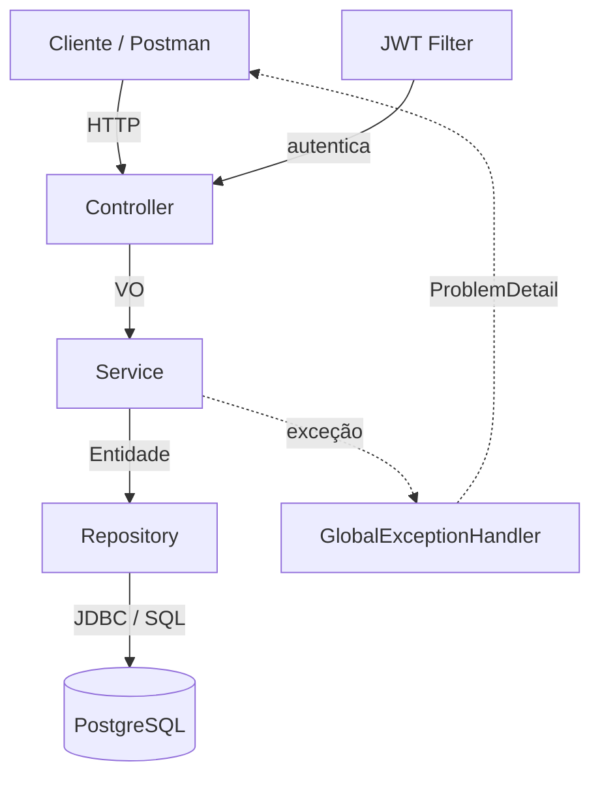
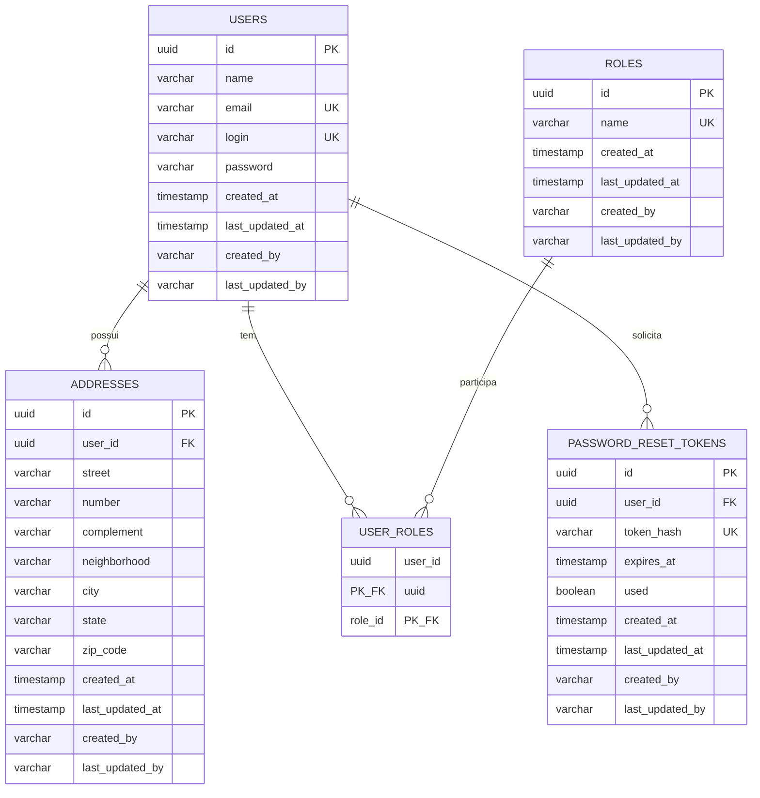

# Relatório Técnico — Tech Challenge Fase 1

## Sistema de Gestão de Restaurantes

**Alunos:**

- Mauricio Borges Florencio
- Felipe Dias Mac Dowell

**Curso:** Pós-Tech — Arquitetura e Desenvolvimento Java
**Stack:** Java 21 · Spring Boot 3.5.x · PostgreSQL · Docker
**Versão do relatório:** 2.0

> Documento vivo, organizado pelas etapas de desenvolvimento. Cada etapa do Sumário de
> Progresso abaixo corresponde a uma seção homônima neste relatório.
>
> Esta é a **continuação da v1.2**: o corpo do relatório foi revisado por inteiro para
> refletir o estado atual do código após três refatorações estruturais, resumidas na seção
> "Revisão v2" logo abaixo.

---

## Sumário de Progresso

| #   | Etapa                                    | Status |
| --- | ---------------------------------------- | ------ |
| 1   | Setup do Projeto                         | ✅     |
| 2   | Modelagem das Entidades e Banco de Dados | ✅     |
| 3   | Migrations e Seeds (Flyway)              | ✅     |
| 4   | Repositories                             | ✅     |
| 5   | Value Objects e Validação                | ✅     |
| 6   | Login, Security e JWT                    | ✅     |
| 7   | Services (regras de negócio)             | ✅     |
| 8   | Controllers Versionados (Endpoints)      | ✅     |
| 9   | Tratamento de Erros (ProblemDetail)      | ✅     |
| 10  | Documentação Swagger                     | ✅     |
| 11  | Execução com Docker Compose              | ✅     |
| 12  | Testes (JUnit + Mockito + ArchUnit)      | ✅     |
| 13  | Entregáveis (Postman, README)            | ✅     |

**Progresso:** 13 de 13 etapas concluídas. 🎉
**Legenda:** ✅ concluída · 🔄 em andamento · ⏳ pendente.

---

## Revisão v2 — o que mudou desde a v1.2

Três refatorações estruturais foram aplicadas, cada uma em um commit próprio, com a
aplicação funcional e verificada ao final de cada etapa. Todas partem da mesma motivação:
**reduzir a mágica de framework e tornar explícito o que antes era implícito** — o que, de
quebra, endereçou uma falha de segurança real.

| # | Mudança | Motivação | Onde está detalhada |
|---|---------|-----------|---------------------|
| 1 | **Identificadores sequenciais → UUID** | Ids sequenciais expostos nas rotas permitiam enumeração de recursos | Etapas 2 e 3 |
| 2 | **Spring Data JPA → JDBC (`JdbcTemplate`)** | Tornar o acesso a dados explícito, sem ORM | Etapas 1 e 4 |
| 3 | **Remoção do Lombok** | Código Java puro, sem geração por processador de anotações | Etapas 1 e 5 |

Além delas, duas correções pontuais entraram junto:

- um `{id}` malformado passou a retornar **400** em vez de 500 (Etapa 9);
- a **listagem paginada deixou de ler a coluna `password`** do banco (Etapa 4).

### Por que a ordem importou

A Fase 2 reescreveria o corpo das entidades de qualquer forma (removendo todas as anotações
de persistência), então o tipo do identificador foi resolvido **antes** dessa reescrita. A
remoção do Lombok — mecânica e de baixo risco — ficou por último, depois que a entidade já
havia estabilizado no formato JDBC.

### O que ficou pendente

Registrado aqui por honestidade de engenharia, não como item concluído:

- **Não há teste automatizado cobrindo o SQL escrito à mão.** Os testes de serviço mockam
  as interfaces de repositório, então passariam mesmo com o SQL quebrado. A verificação foi
  feita manualmente contra PostgreSQL real (ver Etapa 12). Essa é a rede de proteção que a
  saída do ORM removeu e que ainda precisa ser reconstruída — por exemplo com Testcontainers.
- **Os prints da coleção Postman estão desatualizados**: foram capturados quando os
  identificadores ainda eram numéricos e precisam ser regerados.

---

## Mapa dos Entregáveis Obrigatórios

Localização de cada item exigido no enunciado do Tech Challenge dentro deste relatório:

| Entregável obrigatório                    | Onde encontrar               |
| ----------------------------------------- | ---------------------------- |
| Descrição detalhada da arquitetura        | Visão Geral da Arquitetura   |
| Modelagem das entidades e relacionamentos | Etapa 2                      |
| Estrutura do banco de dados (tabelas)     | Etapa 2                      |
| Descrição dos endpoints (com exemplos)    | Etapas 6 e 8                 |
| Documentação Swagger                      | Etapa 10                     |
| Coleção Postman                           | Etapa 13                     |
| Passo a passo com Docker Compose          | Etapa 11                     |

---

## Visão Geral da Arquitetura

### Padrão arquitetural adotado

A aplicação adota uma **Arquitetura em Camadas (Layered Architecture)**, organizada em
quatro camadas principais com responsabilidades bem definidas, somadas a componentes
transversais (configuração, segurança e tratamento de erros).

A escolha por arquitetura em camadas — em vez de Hexagonal ou Clean Architecture — se
justifica pelo escopo da Fase 1: um backend de gestão de usuários com regras de negócio
diretas. A arquitetura em camadas entrega a separação de responsabilidades exigida pelos
princípios SOLID com baixa complexidade acidental, mantendo o código legível, testável e
de fácil evolução para as próximas fases.

### Camadas

| Camada              | Pacote             | Responsabilidade                                                                                                                                        |
| ------------------- | ------------------ | ------------------------------------------------------------------------------------------------------------------------------------------------------- |
| Apresentação (API)  | `controller`       | Expõe os endpoints REST versionados, recebe/retorna VOs, delega para os Services. Não contém regra de negócio.                                            |
| Negócio (Aplicação) | `service`          | Concentra as regras de negócio: unicidade de e-mail, registro da data de alteração, validação de login, troca de senha, busca por nome.                   |
| Persistência        | `repository`       | Abstrai o acesso ao banco. Cada repositório é uma **interface** (o contrato que o Service enxerga) com uma implementação em **JDBC** (`JdbcTemplate`).    |
| Domínio             | `entity`, `enums`  | Modelo de domínio. As entidades são **POJOs de Java puro** — sem anotações de ORM e sem Lombok.                                                           |

### Componentes transversais

| Componente          | Pacote      | Responsabilidade                                                                       |
| ------------------- | ----------- | -------------------------------------------------------------------------------------- |
| VOs                 | `vo`        | Contratos de entrada e saída da API, desacoplados das entidades.                        |
| Tratamento de erros | `exception` | Handler global que padroniza respostas de erro no formato ProblemDetail (RFC 7807).     |
| Segurança           | `security`  | Filtro de autenticação JWT e utilitários de token.                                      |
| Configuração        | `config`    | Configuração do Spring Security, do OpenAPI/Swagger e o provedor de auditoria.          |
| Utilitários         | `util`      | Funções transversais (normalização de texto, verificações).                             |

### Fluxo de uma requisição

```
Cliente HTTP
    │
    ▼
[Controller]  ──valida VO de entrada──►  [Service]  ──regras de negócio──►  [Repository]
    ▲                                          │                                   │
    │                                          ▼                                   ▼
    └──────────  VO de saída  ◄────── mapeamento ◄────── Entidade ◄──────────  PostgreSQL
```

Em caso de erro em qualquer ponto, a exceção é capturada pelo handler global e convertida
em uma resposta padronizada `ProblemDetail`.

### Diagrama de componentes (Mermaid)



---

## Etapa 1 — Setup do Projeto

### Stack e dependências

| Tecnologia            | Versão       | Uso                                                     |
| --------------------- | ------------ | ------------------------------------------------------- |
| Java                  | 21 (LTS)     | Linguagem                                               |
| Spring Boot           | 3.5.x        | Framework base                                          |
| Spring Web            | (gerenciado) | API REST                                                |
| **Spring JDBC**       | (gerenciado) | **Persistência com SQL escrito à mão (`JdbcTemplate`)** |
| **Spring Data Commons** | (gerenciado) | **Apenas os tipos de paginação e o suporte web (`page`/`size`/`sort`)** |
| Spring Validation     | (gerenciado) | Validação de VOs                                        |
| Spring Security       | (gerenciado) | Autenticação JWT                                        |
| Spring Mail           | (gerenciado) | Envio do e-mail de recuperação de senha                 |
| PostgreSQL            | 16           | Banco relacional                                        |
| springdoc-openapi     | 2.8.x        | Documentação Swagger                                    |
| jjwt                  | 0.12.x       | Geração/validação de JWT                                |
| Flyway                | (gerenciado) | Migração e versionamento de schema                      |
| Spring HATEOAS        | (gerenciado) | Links de navegação nas respostas REST                   |
| Spring Boot Actuator  | (gerenciado) | Observabilidade (health, info, metrics)                 |
| MapStruct             | 1.6.x        | Mapeamento VO ↔ entidade (geração em compilação)        |
| JUnit 5 + Mockito     | (gerenciado) | Testes                                                  |
| ArchUnit              | 1.4.x        | Testes automatizados de regras de arquitetura           |

**O que saiu da stack na v2:**

- **Spring Data JPA / Hibernate** — substituído por Spring JDBC. Não há mais ORM no
  projeto: nenhuma entidade é gerenciada, não há contexto de persistência, *lazy loading*
  nem geração/validação de DDL. O único artefato remanescente com "hibernate" no nome é o
  `hibernate-validator`, que é a implementação de **Bean Validation** — coisa diferente do
  ORM, e que continua em uso.
- **Lombok** — substituído por código Java escrito à mão. Com isso saiu também o
  `lombok-mapstruct-binding`, que existia unicamente para ordenar os dois processadores de
  anotações; o MapStruct ficou sozinho no `annotationProcessorPaths`.

> **Por que o Spring Data Commons continua.** A API expõe paginação (`page`/`size`/`sort`) e
> devolve `PagedModel` do HATEOAS. Os tipos `Page`, `Pageable` e `PageRequest`, e o suporte
> web que resolve esses parâmetros, vivem no Spring Data Commons — não no Spring Data JPA.
> Mantê-lo preserva o contrato REST intacto sem reintroduzir uma linha de ORM.

### Estrutura de pacotes

Raiz: `com.postech.restaurantes`

```
src/main/java/com/postech/restaurantes/
├── RestaurantesApplication.java
├── config/              # SecurityConfig, OpenApiConfig, AuditorProvider
├── controller/
├── entity/              # User, Role, Address, PasswordResetToken, Auditable (POJOs)
├── enums/               # RoleName
├── exception/
├── mapper/              # mapeadores MapStruct (VO ↔ entidade)
├── repository/          # interfaces + implementações *Jdbc
├── security/
├── service/
├── util/                # TextUtils, ObjectUtils (funções transversais)
└── vo/                  # Value Objects (records imutáveis)
    ├── shared/          # VOs de valor estáveis: Email, ZipCode
    └── v1/              # VOs de contrato, versionados junto com a API
        ├── request/     # VOs de entrada (sufixo Request)
        └── response/    # VOs de saída (sufixo Response)
```

---

## Etapa 2 — Modelagem das Entidades e Banco de Dados

### Abordagem de projeto

O modelo foi construído seguindo a divisão clássica de projeto de banco de dados em
três níveis — conceitual, lógico e físico (Machado) — e os princípios do modelo
relacional, normalização e integridade referencial (Date). O objetivo foi um esquema
**normalizado até a 3ª Forma Normal / BCNF**, já preparado para autenticação e
autorização com Spring Security.

### Tabelas do modelo

| Tabela                  | Tipo                     | Responsabilidade                                                   |
| ----------------------- | ------------------------ | ------------------------------------------------------------------ |
| `users`                 | Entidade forte           | Identidade e credenciais do usuário                                |
| `roles`                 | Entidade forte (lookup)  | Papéis de autorização                                              |
| `user_roles`            | Tabela associativa       | Resolve o N:M entre usuários e papéis                              |
| `addresses`             | Entidade                 | Endereços do usuário (1:N)                                         |
| `password_reset_tokens` | Entidade                 | Tokens de uso único para redefinição de senha (1:N com `users`)    |

### Chaves primárias: UUID aleatório

Todas as chaves primárias são **`UUID`**, geradas pelo próprio banco através de
`DEFAULT gen_random_uuid()` — função nativa do PostgreSQL desde a versão 13, sem
necessidade da extensão `pgcrypto`.

**Motivação (segurança).** Até a v1.2 as chaves eram `BIGINT GENERATED ALWAYS AS IDENTITY`,
ou seja, sequenciais. Um identificador sequencial exposto em uma rota como
`/api/v1/users/{id}` permite **enumeração de recursos**: um cliente autenticado consegue
varrer `1, 2, 3...` e inferir a existência, a quantidade e o ritmo de criação de registros
alheios — mesmo quando a autorização por posse (Etapa 6) impede a leitura do conteúdo, o
código de resposta já diferencia "existe, mas não é seu" (403) de "não existe" (404). O
UUID v4 é aleatório e, na prática, não enumerável.

A geração ficou no banco, e não na aplicação, por dois motivos: o valor default vale para
**qualquer** origem de escrita (inclusive seeds e scripts manuais), e o `INSERT ...
RETURNING id` devolve o identificador na mesma ida ao banco.

> **Nota.** O UUID dificulta a enumeração, mas **não** é um mecanismo de autorização. Ele
> complementa — não substitui — a verificação de posse descrita na Etapa 6.

### Relacionamentos e cardinalidade

| Relacionamento                       | Cardinalidade | Implementação                                      |
| ------------------------------------ | ------------- | -------------------------------------------------- |
| `users` ↔ `addresses`                | 1 : N         | FK `addresses.user_id`                              |
| `users` ↔ `roles`                    | N : M         | Tabela associativa `user_roles`                     |
| `users` ↔ `password_reset_tokens`    | 1 : N         | FK `password_reset_tokens.user_id`                  |

Regras de integridade referencial: `addresses.user_id`, `password_reset_tokens.user_id` e
as FKs de `user_roles` usam `ON DELETE CASCADE` — remover um usuário remove seus endereços,
seus tokens de redefinição de senha e seus vínculos de papel, sem deixar registros órfãos.

**Como isso aparece no código (v2).** Sem ORM, não há `@OneToMany`/`@ManyToOne`
declarando esses relacionamentos. Eles existem no schema (as FKs acima) e são materializados
no repositório:

- `User` continua sendo a **raiz do agregado** e carrega `Set<Role>` e `List<Address>`;
- `Address` e `PasswordResetToken` referenciam o usuário por **`UUID userId`**, e não pelo
  objeto `User` inteiro. Sem carregamento preguiçoso, guardar a entidade completa obrigaria
  a carregá-la (com papéis e demais endereços) toda vez que um endereço fosse lido.

### Justificativa da normalização

- **1FN (atomicidade, sem grupos repetitivos):** papéis e endereços foram extraídos para
  tabelas próprias. Mantê-los como colunas em `users` (ex.: `papel1`, `papel2`,
  `endereco1`...) violaria a 1FN. A associativa `user_roles` e a tabela `addresses`
  eliminam os grupos repetitivos.
- **2FN (sem dependência parcial):** a única chave composta é a de `user_roles`
  (`user_id`, `role_id`), que não possui atributos não-chave dependentes de parte da chave.
- **3FN (sem dependência transitiva):** em `users`, todo atributo depende apenas da PK.
  O nome do papel reside em `roles`, evitando repetir o texto do papel em cada vínculo.
- **BCNF:** `email` e `login` são chaves candidatas (únicas) de `users`; todo determinante
  é uma chave candidata.

A troca de `BIGINT` por `UUID` não altera nenhuma dessas propriedades: muda o **domínio** da
chave, não as dependências funcionais.

### Decisão: papéis como tabela (não enum)

Os dois tipos de usuário exigidos (Dono de restaurante e Cliente) foram modelados como
**papéis** (`ROLE_OWNER`, `ROLE_CUSTOMER`), persistidos na tabela `roles` e vinculados ao
usuário via `user_roles`. Essa escolha:

1. Atende ao requisito de "tabela de ROLE para controle dos papéis".
2. É exatamente a estrutura que o Spring Security consome para montar as autoridades
   (`GrantedAuthority`).
3. Permite que um usuário acumule papéis (ex.: um dono que também é cliente) sem alteração
   de schema, diferentemente de um enum de coluna única.

### Auditoria

Todas as entidades (`User`, `Role`, `Address`, `PasswordResetToken`) estendem a classe
base `Auditable`, que registra em toda escrita:

- `created_at` (imutável) / `last_updated_at` — atendendo ao requisito "registro da data da
  última alteração". Tipo usado: `LocalDateTime` (API moderna de data/hora do Java, em vez
  do legado `java.util.Date`).
- `created_by` (imutável) / `last_updated_by` — registram **quem** criou/alterou o registro.

**Como funciona na v2.** Até a v1.2 o preenchimento era automático, via Spring Data JPA
Auditing (`@EnableJpaAuditing` + `AuditingEntityListener`). Esse gancho é uma facilidade do
ORM e desapareceu junto com ele. No lugar:

- os repositórios chamam `markCreated(...)` ou `markUpdated(...)` **imediatamente antes** de
  cada INSERT/UPDATE;
- o `AuditorProvider` (pacote `config`) resolve quem está gravando, lendo o login autenticado
  em `SecurityContextHolder` — mesmo padrão já usado em `UserSecurity.isSelf` — com fallback
  para `"system"` quando não há usuário autenticado (auto-cadastro público, seeds SQL). O
  token anônimo do Spring Security também cai em `"system"`, para não gravar
  `"anonymousUser"`.

Um detalhe de projeto: os campos de `Auditable` **não têm setters públicos**. Eles mudam
apenas por `markCreated`, `markUpdated` e `restoreAudit` (este último usado ao ler do banco).
Isso expressa a intenção de cada operação e impede que uma data de criação seja sobrescrita
por engano — algo que o antigo `updatable = false` garantia via anotação.

### Diagrama Entidade-Relacionamento



### Estrutura do banco de dados (tabelas)

O schema é **gerenciado pelo Flyway** através de migrations SQL versionadas em
`src/main/resources/db/migration`. Na v2 o Flyway é a **única** fonte da verdade do schema:
não há mais ORM gerando nem validando DDL (o antigo `ddl-auto: validate` deixou de existir
junto com o Hibernate). Cada mudança futura entra como uma nova migration, nunca por
alteração automática.

Estado atual das tabelas, após a migration `V6` que converteu as chaves para `UUID`:

```sql
CREATE TABLE users (
    id              UUID         PRIMARY KEY DEFAULT gen_random_uuid(),
    name            VARCHAR(255) NOT NULL,
    email           VARCHAR(255) NOT NULL UNIQUE,
    login           VARCHAR(255) NOT NULL UNIQUE,
    password        VARCHAR(255) NOT NULL,
    created_at      TIMESTAMP    NOT NULL,
    last_updated_at TIMESTAMP    NOT NULL,
    created_by      VARCHAR(255) NOT NULL,
    last_updated_by VARCHAR(255) NOT NULL
);

CREATE TABLE roles (
    id   UUID        PRIMARY KEY DEFAULT gen_random_uuid(),
    name VARCHAR(50) NOT NULL UNIQUE  -- ROLE_OWNER, ROLE_CUSTOMER, ROLE_ADMIN
    -- + colunas de auditoria
);

CREATE TABLE user_roles (
    user_id UUID NOT NULL REFERENCES users (id) ON DELETE CASCADE,
    role_id UUID NOT NULL REFERENCES roles (id) ON DELETE CASCADE,
    PRIMARY KEY (user_id, role_id)
);

CREATE TABLE addresses (
    id           UUID         PRIMARY KEY DEFAULT gen_random_uuid(),
    user_id      UUID         NOT NULL REFERENCES users (id) ON DELETE CASCADE,
    street       VARCHAR(255) NOT NULL,
    number       VARCHAR(255),
    complement   VARCHAR(255),
    neighborhood VARCHAR(255),
    city         VARCHAR(255) NOT NULL,
    state        VARCHAR(2)   NOT NULL,
    zip_code     VARCHAR(9)   NOT NULL
    -- + colunas de auditoria
);

CREATE TABLE password_reset_tokens (
    id         UUID         PRIMARY KEY DEFAULT gen_random_uuid(),
    user_id    UUID         NOT NULL REFERENCES users (id) ON DELETE CASCADE,
    token_hash VARCHAR(255) NOT NULL UNIQUE,
    expires_at TIMESTAMP    NOT NULL,
    used       BOOLEAN      NOT NULL DEFAULT FALSE
    -- + colunas de auditoria
);
```

---

## Etapa 3 — Migrations e Seeds (Flyway)

O versionamento do banco é feito com **Flyway**: o schema e os dados iniciais são definidos
por scripts SQL versionados, aplicados automaticamente na inicialização da aplicação.

### Convenção e localização

- Local: `src/main/resources/db/migration`.
- Nomenclatura: `V<versão>__<descrição>.sql` (dois underscores). Ex.: `V1__create_initial_schema.sql`.
- A ordem de aplicação segue o número da versão.

### Migrations do projeto

| Versão | Arquivo                              | Conteúdo                                                                                                                        |
| ------ | ------------------------------------ | ------------------------------------------------------------------------------------------------------------------------------- |
| V1     | `V1__create_initial_schema.sql`      | DDL das tabelas (`users`, `roles`, `user_roles`, `addresses`) + **seed dos papéis** (`ROLE_OWNER`, `ROLE_CUSTOMER`, `ROLE_ADMIN`) |
| V2     | `V2__seed_demo_users.sql`            | **Seed de usuários de demonstração**: um dono e um cliente, com papéis e endereços                                                |
| V3     | `V3__seed_admin_user.sql`            | **Seed do usuário administrador** (`ROLE_ADMIN`), usado nos cenários de escopo administrativo                                     |
| V4     | `V4__create_password_reset_tokens.sql` | DDL da tabela `password_reset_tokens`, para o fluxo de recuperação de senha por e-mail                                          |
| V5     | `V5__add_audit_columns.sql`          | Colunas de auditoria (`created_by`/`last_updated_by`/`created_at`/`last_updated_at`) em todas as tabelas                          |
| **V6** | **`V6__convert_ids_to_uuid.sql`**    | **Converte todas as PKs e FKs de `BIGINT` sequencial para `UUID`, gerado pelo banco via `DEFAULT gen_random_uuid()`**             |

### Anatomia da migration V6

Converter a chave primária de tabelas que já contêm dados **e** são referenciadas por
chaves estrangeiras não é uma troca de tipo direta. A `V6` executa a conversão preservando
os vínculos existentes, nesta ordem:

1. Adiciona uma coluna `UUID` com `DEFAULT gen_random_uuid()` em cada tabela com PK própria.
   O `ALTER TABLE ... ADD COLUMN ... DEFAULT` já popula as linhas existentes.
2. Adiciona as colunas `UUID` correspondentes a cada FK, ainda anuláveis.
3. **Traduz os vínculos**: para cada FK antiga (`BIGINT`), copia o UUID correspondente da
   tabela pai, via `UPDATE ... FROM`.
4. Torna as novas FKs obrigatórias (`SET NOT NULL`), como as antigas.
5. Remove as constraints que dependem das colunas antigas — as FKs primeiro, porque
   enquanto existirem as PKs referenciadas não podem ser descartadas.
6. Descarta as colunas `BIGINT` e renomeia as novas para os nomes originais.
7. Recria as chaves primárias e as estrangeiras, preservando o `ON DELETE CASCADE`.
8. Recria o índice de `password_reset_tokens.user_id`, descartado junto com a coluna antiga.

Como os vínculos são traduzidos antes do descarte, os seeds das migrations `V2` e `V3`
sobrevivem intactos: os usuários de demonstração mantêm seus papéis e endereços.

### Seeds

- **Papéis (V1):** dados de referência essenciais — sem eles, nenhum usuário pode ser
  criado (todo usuário precisa de pelo menos um papel).
- **Usuários de demonstração (V2, V3):** permitem testar o login imediatamente após subir a
  aplicação. As senhas estão em **hash BCrypt** (mesmo algoritmo do `BCryptPasswordEncoder`):

  | Login              | Senha           | Papel            |
  | ------------------ | --------------- | ---------------- |
  | `dono.restaurante` | `dono12345`     | `ROLE_OWNER`     |
  | `cliente.demo`     | `cliente12345`  | `ROLE_CUSTOMER`  |
  | `admin.demo`       | `admin12345`    | `ROLE_ADMIN`     |

  > Os seeds de demonstração são apenas para teste; remova-os antes de um ambiente real.
  > O `admin.demo` (V3) existe porque `ROLE_ADMIN` **não** pode ser obtido pelo autocadastro
  > público (ver Etapas 6 e 7) — é a via legítima de criar um administrador nesta fase.

### Regras de uso do Flyway

- **Migrations aplicadas são imutáveis.** O Flyway grava um *checksum* de cada script na
  tabela `flyway_schema_history`; alterar um script já aplicado quebra a validação. Toda
  mudança no banco entra como uma **nova** migration (`V7`, `V8`...).
- **Como criar uma nova migration:** adicione um arquivo `V<n>__descricao.sql` em
  `db/migration` com o próximo número e suba a aplicação — o Flyway aplica o que ainda não
  foi executado.
- **Histórico:** a tabela `flyway_schema_history` registra o que já foi aplicado, quando e
  com qual checksum. Toda migration nova ganha também uma entrada no `CHANGELOG.md` do módulo.

---

## Etapa 4 — Repositories

Esta é a etapa mais afetada pela v2. Até a v1.2, o acesso a dados era feito por interfaces
`JpaRepository`, cuja implementação o Spring Data gerava em tempo de execução a partir do
nome dos métodos. Na v2, **todo o SQL é escrito à mão** sobre
`NamedParameterJdbcTemplate`.

### Estrutura: interface + implementação

Cada repositório é um par:

| Interface (contrato)          | Implementação            | Operações                                                                                                          |
| ----------------------------- | ------------------------ | ------------------------------------------------------------------------------------------------------------------ |
| `UserRepository`              | `UserRepositoryJdbc`     | `findById`, `findByLogin`, `findByEmail`, `existsById`, `findAll(Pageable)`, `findByNameContainingIgnoreCase(name, Pageable)`, `save`, `deleteById` |
| `RoleRepository`              | `RoleRepositoryJdbc`     | `findByName`                                                                                                        |
| `PasswordResetTokenRepository`| `PasswordResetTokenJdbc` | `findByTokenHash`, `save`                                                                                            |

A interface é mantida deliberadamente: é o que a camada de Service enxerga e o que os testes
unitários substituem por mock. Como as assinaturas não mudaram, `UserServiceTest` continuou
válido sem alteração na mecânica de mock.

> Os métodos `existsByEmail`/`existsByLogin`, declarados na v1.2, foram removidos: nunca
> chegaram a ser chamados — a unicidade é verificada por `findByEmail`/`findByLogin`, que
> precisam do registro encontrado para ignorar o próprio usuário durante uma atualização.

### O que o ORM fazia implicitamente e agora é explícito

**Cascade e `orphanRemoval` dos endereços.** O `save` de `User` é um save de agregado:
grava o usuário, remove do banco os endereços que não estão mais na lista e insere/atualiza
os presentes. É a tradução literal do que o `CascadeType.ALL` + `orphanRemoval = true`
faziam.

**O `@ManyToMany` de papéis.** Vira a reescrita da tabela `user_roles`: apaga os vínculos do
usuário e reinsere a partir do conjunto atual (estratégia adequada para um conjunto pequeno
e fechado como papéis).

**O carregamento das associações.** Papéis e endereços de uma página inteira são carregados
em **duas consultas** — uma por associação, com `WHERE ... IN (:userIds)` — e não uma por
usuário. O problema N+1, que o *fetch* do ORM escondia, fica visível e resolvido no ponto
onde a consulta é escrita.

**A auditoria.** Aplicada pelos repositórios antes de cada gravação (detalhado na Etapa 2).

**A obtenção da chave gerada.** Como o UUID é gerado pelo banco, os INSERTs usam
`INSERT ... RETURNING id`, e o valor volta na mesma ida ao banco.

### Ordenação: por que existe uma lista de colunas permitidas

A listagem aceita `?sort=campo,direção`. Diferentemente dos valores, **o nome de uma coluna
não pode ser parametrizado** em SQL: ele precisa ser concatenado na cláusula `ORDER BY`.
Concatenar direto o que veio da requisição seria uma porta aberta para injeção de SQL.

A implementação mantém um mapa fixo de propriedades aceitas (`id`, `name`, `email`, `login`,
`createdAt`, `lastUpdatedAt`) para os nomes reais das colunas. Qualquer propriedade fora
desse mapa é ignorada, e a consulta cai na ordenação padrão (`name ASC`). `password` está
fora do mapa de propósito.

Verificado em execução: `?sort=password,asc` e `?sort=name;DROP TABLE users--,asc` retornam
`200` com a ordenação padrão e sem qualquer efeito colateral no banco.

### A senha e o par leitura/gravação

A listagem paginada **não lê a coluna `password`**: nenhum consumidor precisa dela — o
`UserResponse` não expõe a senha e a página nunca é gravada de volta —, e trazê-la colocaria
o hash de todos os usuários da página em memória sem motivo.

Já `findById` e `findByLogin` **continuam lendo** o hash, e isso é essencial: o primeiro
alimenta o `save`, que reescreve a coluna `password`; o segundo alimenta a autenticação.
Carregar o usuário sem o hash e salvá-lo em seguida **apagaria a senha** de quem atualizasse
o próprio cadastro. Leitura completa e gravação completa andam juntas — por isso a separação
é feita só na listagem, e não de forma generalizada.

### Convivência com as regras de arquitetura

A regra do ArchUnit que exigia que tudo em `..repository..` fosse interface precisou ser
ajustada, já que agora existem classes de implementação. A alternativa de mover as
implementações para outro pacote foi descartada: elas passariam a depender de
`..repository..` de fora da camada, violando a regra de que o pacote só pode ser acessado
pelo Service. As implementações ficam no mesmo pacote, sufixadas com `Jdbc`, e a regra passa
a exigir interface para todo o resto — preservando a intenção original (o contrato público
do pacote continua sendo de interfaces).

---

## Etapa 5 — Value Objects e Validação

Por decisão de projeto, **todos os objetos de transferência da API são Value Objects**
(`record` imutáveis), aproveitando a imutabilidade e a igualdade por valor do `record` do
Java 21. O projeto não utiliza a nomenclatura de objeto de transferência tradicional.

### Estratégia de validação

Os VOs de entrada validam com **Bean Validation** (`@NotBlank`, `@Email`, `@Size`,
`@Pattern`), o que permite validação agregada (todos os erros de uma vez) e documentação
automática no Swagger. Os **VOs de valor** (`Email`, `ZipCode`) atuam no domínio, no
Service: além de revalidar, **normalizam** os dados — o `Email` para minúsculas (o que
torna a regra de e-mail único correta, evitando que `A@b.com` e `a@b.com` sejam tratados
como distintos) e o `ZipCode` para os 8 dígitos.

A validação ficou intocada pelas mudanças da v2: ela sempre viveu nos VOs, nunca nas
entidades. Essa separação, feita desde a v1.0, é o que permitiu remover o ORM sem tocar em
uma linha de regra de validação.

### Classes utilitárias (`util`)

| Classe        | Responsabilidade                                                             |
| ------------- | ---------------------------------------------------------------------------- |
| `TextUtils`   | normalização de texto: trim, minúsculas, remoção de acentos, só dígitos       |
| `ObjectUtils` | verificações de presença: `isBlank`, `isEmpty`, `requireNonNull`, `requireNonBlank` |

### VOs de valor (`vo/shared`)

| VO         | Invariante                                    |
| ---------- | --------------------------------------------- |
| `Email`    | formato válido; normalizado para minúsculas   |
| `ZipCode`  | 8 dígitos; formatação `00000-000` sob demanda |

### VOs de contrato (`vo/v1`)

**Entrada** (`vo/v1/request`, sufixo `Request`): `UserRegistrationRequest`,
`UserUpdateRequest` (sem senha), `PasswordChangeRequest`, `LoginRequest`, `AddressRequest`,
`ForgotPasswordRequest`, `ResetPasswordRequest`.

**Saída** (`vo/v1/response`, sufixo `Response`): `UserResponse` (nunca expõe senha),
`AddressResponse`, `RoleResponse`, `AuthResponse` (token JWT + expiração). Os campos `id`
desses VOs passaram de `Long` para `UUID` na v2.

### Versionamento dos VOs

Os VOs de contrato vivem sob `vo/v1`, acompanhando a versão da API (`/api/v1`). Uma futura
`v2` ganha `vo/v2/...` sem quebrar os clientes da `v1`. Os VOs de valor (`Email`,
`ZipCode`) ficam em `vo/shared` por serem conceitos de domínio estáveis.

### Mapeadores (`mapper`, MapStruct)

| Mapeador        | Converte                                                    |
| --------------- | ----------------------------------------------------------- |
| `UserMapper`    | `User` ↔ `UserRegistrationRequest` / `UserResponse`          |
| `AddressMapper` | `Address` ↔ `AddressRequest` / `AddressResponse`             |

Gerados em tempo de compilação (sem reflection), injetados como beans Spring. Senha e
papéis ficam como `ignore` no mapeamento de entrada — são resolvidos no Service (hash da
senha e busca das entidades `Role`).

**Efeito da remoção do Lombok.** Os mapeadores não precisaram de nenhuma alteração. O
MapStruct descobre um builder por convenção — um método estático `builder()` que devolve um
tipo com `build()` —, então basta que o builder exista. Os builders foram **reescritos à
mão** nas entidades exatamente por isso: preservada a convenção, o MapStruct passou a gerar
`User.Builder` no lugar de `User.UserBuilder` sozinho, sem propagar a mudança para nenhum
ponto de chamada.

O `@AfterMapping` que mantinha a referência de volta dos endereços ao usuário deixou de
existir: com `Address` referenciando `userId` (e não o objeto `User`), quem preenche o
vínculo é o repositório, no momento da gravação — quando o id do usuário já é conhecido.

**Sobre a remoção do Lombok.** As entidades declaram explicitamente construtores, getters,
setters e builder. A única exceção é `Auditable`, que não ganhou setters, pelo motivo
descrito na Etapa 2. O `MailServiceImpl` trocou `@Slf4j` por um logger declarado via
`LoggerFactory`.

Princípio aplicado (SOLID/clean code): a entidade nunca cruza a fronteira da API. O
Controller trafega apenas VOs; o Service faz a tradução VO ↔ entidade — protegendo o
domínio, impedindo o vazamento da senha e desacoplando o contrato REST do schema.

---

## Etapa 6 — Login, Security e JWT

Autenticação com **Spring Security em modo stateless** (sem sessão no servidor) e tokens
**JWT** assinados em HMAC-SHA256. Implementa o serviço obrigatório de validação de login.

### Fluxo de autenticação

1. O `AuthController` recebe as credenciais no endpoint de login.
2. O `AuthenticationService` delega ao `AuthenticationManager`, que valida login e senha —
   a comparação senha × hash é feita com **BCrypt** via `CustomUserDetailsService`.
3. Se válido, o `JwtService` gera um token JWT assinado.
4. Nas requisições seguintes, o `JwtAuthenticationFilter` lê o cabeçalho `Bearer`, valida
   o token e popula o contexto de segurança.

### Componentes

| Classe                     | Pacote       | Papel                                                             |
| -------------------------- | ------------ | ----------------------------------------------------------------- |
| `SecurityConfig`           | `config`     | Filter chain, `PasswordEncoder` (BCrypt), `AuthenticationManager`  |
| `JwtService`               | `security`   | Geração e validação de tokens JWT                                  |
| `JwtAuthenticationFilter`  | `security`   | Autentica cada requisição via token Bearer                         |
| `CustomUserDetailsService` | `security`   | Carrega o usuário e converte papéis em autoridades                 |
| `UserSecurity`             | `security`   | Suporte à autorização por posse (`isSelf`) usado no `@PreAuthorize`|
| `AuthenticationService`    | `service`    | Valida credenciais e emite o token                                 |
| `AuthController`           | `controller` | Endpoints de login e de recuperação de senha                       |

### Controle de acesso

Endpoints **públicos**: login e recuperação de senha (`/api/v1/auth/**`), auto-cadastro
(`POST /api/v1/users`), Swagger e health checks. Todos os demais exigem token válido. O
segredo (`JWT_SECRET`, no mínimo 256 bits) e a expiração vêm de variáveis de ambiente.

**Autorização por posse (method security).** Além de exigir autenticação, as operações por
id (`GET/PUT/PATCH/DELETE /api/v1/users/{id}`) aplicam autorização em nível de método, com
`@EnableMethodSecurity` e `@PreAuthorize`. A regra é **dono do recurso ou administrador**:

```java
@PreAuthorize("hasRole('ADMIN') or @userSecurity.isSelf(#id, authentication)")
```

O bean `UserSecurity.isSelf(...)` resolve o usuário autenticado pelo login e compara o id
do recurso com o id do próprio usuário (agora um `UUID`). Sem essa verificação, qualquer
token válido poderia ler, alterar ou excluir **qualquer** usuário (uma falha de referência
direta a objeto — *IDOR*). Um usuário comum que tente acessar o recurso de outro recebe
`403`; um `ROLE_ADMIN` acessa qualquer um. As consultas de coleção (`GET /users` e busca por
nome) permanecem disponíveis a qualquer usuário autenticado, por serem parte do requisito de
busca.

> A adoção de UUID (Etapa 2) **complementa** essa defesa, dificultando a descoberta de ids
> alheios, mas não a substitui: a autorização por posse continua sendo o que impede o acesso.

**Autocadastro restrito.** O `POST /api/v1/users` é público (auto-registro) e, por isso, o
serviço **rejeita** solicitações que incluam `ROLE_ADMIN` (retorno `403`), impedindo
escalonamento de privilégio. Papéis de administrador só nascem por seed (migration V3) ou
por um fluxo autenticado. Detalhe da regra na Etapa 7.

### Endpoint de autenticação

**`POST /api/v1/auth/login`** — valida login e senha; retorna um token JWT. Público.

Requisição:

```json
{
  "login": "joao.silva",
  "password": "senhaSegura123"
}
```

Resposta `200 OK`:

```json
{
  "token": "eyJhbGciOiJIUzI1NiJ9...",
  "type": "Bearer",
  "expiresIn": 3600000
}
```

Credenciais inválidas retornam `401 Unauthorized` (padronizado como `ProblemDetail` na
Etapa 9). Para acessar endpoints protegidos, envie `Authorization: Bearer <token>`.

### Recuperação de senha

Fluxo em dois passos, sem exigir a senha anterior:

1. **`POST /api/v1/auth/forgot-password`** — recebe o e-mail. Se existir, gera um token de
   uso único (32 bytes de `SecureRandom`, codificados em Base64 URL) e o envia por e-mail.
   **A resposta é idêntica exista ou não o e-mail** (`202 Accepted`), para não revelar quais
   endereços estão cadastrados — a mesma preocupação com enumeração que motivou o UUID.
2. **`POST /api/v1/auth/reset-password`** — recebe o token e a nova senha.

O token em claro **nunca é persistido**: o banco guarda apenas seu hash SHA-256. Cada token
expira e é de uso único (a coluna `used` é marcada no resgate).

---

## Etapa 7 — Services (regras de negócio)

O `UserService` concentra as regras de negócio, traduzindo VOs ↔ entidades (via MapStruct)
e orquestrando repositórios, normalização e segurança. As exceções de domínio lançadas
aqui são padronizadas como `ProblemDetail` na Etapa 9.

### Operações

| Método                              | Regras aplicadas                                                                                                                                                                                                                                                                          |
| ----------------------------------- | ----------------------------------------------------------------------------------------------------------------------------------------------------------------------------------------------------------------------------------------------------------------------------------------- |
| `register`                          | **Rejeita autocadastro com `ROLE_ADMIN`** (endpoint público → `ForbiddenOperationException`/403), normaliza o e-mail (VO `Email`), garante unicidade de e-mail e login, aplica **hash BCrypt** na senha, resolve os papéis (`RoleName` → entidades `Role`) e normaliza os CEPs (VO `ZipCode`). |
| `update`                            | Atualiza nome, e-mail e login (revalidando unicidade, ignorando o próprio registro) e substitui os endereços. **Não** altera a senha.                                                                                                                                                       |
| `changePassword`                    | Confere a senha atual (`BCrypt.matches`), valida que a nova senha e a confirmação coincidem, e grava o novo hash.                                                                                                                                                                           |
| `delete`                            | Remove o usuário (e, por cascade do banco, seus endereços, tokens e vínculos de papel).                                                                                                                                                                                                     |
| `findById` / `findByName` / `findAll` | Consultas; `findByName` usa busca parcial sem diferenciar maiúsculas/minúsculas.                                                                                                                                                                                                          |

O `PasswordResetService` cuida do fluxo de recuperação de senha descrito na Etapa 6.

### Exceções de domínio

| Exceção                          | Situação                                                | HTTP (Etapa 9) |
| -------------------------------- | ------------------------------------------------------- | -------------- |
| `ResourceNotFoundException`      | usuário ou papel inexistente                             | 404            |
| `DuplicateResourceException`     | e-mail ou login já cadastrado                            | 409            |
| `InvalidPasswordException`       | senha atual incorreta ou confirmação divergente          | 400            |
| `ForbiddenOperationException`    | autocadastro solicitando papel privilegiado (`ROLE_ADMIN`) | 403          |
| `InvalidOrExpiredTokenException` | token de redefinição inexistente, expirado ou já usado   | 400            |

### Detalhe que garante o requisito de e-mail único

A unicidade do e-mail só é correta porque o VO `Email` **normaliza para minúsculas** antes
da checagem e da gravação. Sem isso, `Joao@x.com` e `joao@x.com` passariam pela verificação
como distintos e quebrariam a regra. A normalização do e-mail é, portanto, parte da regra
de negócio — não um detalhe cosmético.

---

## Etapa 8 — Controllers Versionados (Endpoints)

**Estratégia de versionamento:** versionamento por path (`/api/v1/...`), espelhado na
organização dos VOs (`vo/v1`). Permite evoluir a API para `v2` sem quebrar clientes.

### Endpoints de usuário

Todos sob `/api/v1/users`. As respostas incluem links **HATEOAS** (`self` e `users`),
montados pelo `UserModelAssembler`. O `{id}` é um **UUID**.

| Método   | Rota                              | Descrição                        | Sucesso                  | Autorização                |
| -------- | --------------------------------- | -------------------------------- | ------------------------ | -------------------------- |
| `POST`   | `/api/v1/users`                   | Cadastro (público)               | `201 Created` + `Location` | Pública (sem `ROLE_ADMIN`) |
| `GET`    | `/api/v1/users/{id}`              | Consulta por id                  | `200 OK`                 | Dono ou `ROLE_ADMIN`       |
| `GET`    | `/api/v1/users?name=...`          | Busca paginada por nome (parcial)| `200 OK`                 | Autenticado                |
| `GET`    | `/api/v1/users`                   | Lista paginada                   | `200 OK`                 | Autenticado                |
| `PUT`    | `/api/v1/users/{id}`              | Atualiza dados (endpoint distinto) | `200 OK`               | Dono ou `ROLE_ADMIN`       |
| `PATCH`  | `/api/v1/users/{id}/password`     | Troca de senha (endpoint exclusivo) | `204 No Content`      | Dono ou `ROLE_ADMIN`       |
| `DELETE` | `/api/v1/users/{id}`              | Exclui                           | `204 No Content`         | Dono ou `ROLE_ADMIN`       |

#### Paginação

A listagem e a busca por nome são **paginadas**, aceitando os parâmetros de query:

- `page` — número da página (base 0; padrão `0`);
- `size` — itens por página (padrão `20`);
- `sort` — campo e direção de ordenação (padrão `name`; ex.: `sort=name,desc`). Apenas as
  propriedades permitidas são aceitas — ver Etapa 4.

Exemplo: `GET /api/v1/users?page=0&size=10&sort=name,asc`. A resposta usa `PagedModel`
(HATEOAS): cada usuário vem com seus links, e o envelope traz os links de navegação
(`first`, `prev`, `next`, `last`) e o bloco `page` com os metadados:

```json
{
  "_embedded": { "userResponseList": [ /* usuários com _links */ ] },
  "_links": {
    "first": { "href": ".../api/v1/users?page=0&size=10" },
    "self":  { "href": ".../api/v1/users?page=0&size=10" },
    "next":  { "href": ".../api/v1/users?page=1&size=10" },
    "last":  { "href": ".../api/v1/users?page=4&size=10" }
  },
  "page": { "size": 10, "totalElements": 42, "totalPages": 5, "number": 0 }
}
```

**Exemplo — cadastro** (`POST /api/v1/users`):

```json
{
  "name": "João Silva",
  "email": "joao.silva@email.com",
  "login": "joao.silva",
  "password": "senhaSegura123",
  "roles": ["ROLE_CUSTOMER"],
  "addresses": [
    {
      "street": "Rua das Flores",
      "number": "100",
      "complement": "Apto 21",
      "neighborhood": "Centro",
      "city": "São Paulo",
      "state": "SP",
      "zipCode": "01001-000"
    }
  ]
}
```

Resposta `201 Created` (com links HATEOAS):

```json
{
  "id": "7295577e-afe6-4875-8bbf-d21c21860711",
  "name": "João Silva",
  "email": "joao.silva@email.com",
  "login": "joao.silva",
  "roles": [{ "id": "e19edd91-3b6e-4225-a721-ebfd6a5a576b", "name": "ROLE_CUSTOMER" }],
  "addresses": [{ "id": "a0d64f5e-e511-4b52-871d-582d7a8b18d0", "street": "Rua das Flores",
                  "number": "100", "complement": "Apto 21", "neighborhood": "Centro",
                  "city": "São Paulo", "state": "SP", "zipCode": "01001000" }],
  "createdAt": "2026-06-28T10:00:00",
  "lastUpdatedAt": "2026-06-28T10:00:00",
  "_links": {
    "self":  { "href": "http://localhost:8080/api/v1/users/7295577e-afe6-4875-8bbf-d21c21860711" },
    "users": { "href": "http://localhost:8080/api/v1/users" }
  }
}
```

**Exemplo — troca de senha** (`PATCH /api/v1/users/{id}/password`):

```json
{
  "currentPassword": "senhaSegura123",
  "newPassword": "novaSenha456",
  "confirmPassword": "novaSenha456"
}
```

Respostas de erro (e-mail duplicado, recurso inexistente, senha incorreta) seguem o padrão
`ProblemDetail` da Etapa 9.

---

## Etapa 9 — Tratamento de Erros (ProblemDetail)

O `GlobalExceptionHandler` (`@RestControllerAdvice`) padroniza **todas** as respostas de
erro no formato **ProblemDetail (RFC 7807)**, nativo do Spring 6, acrescentando um
`timestamp` e um `type` próprio por categoria (constantes em `ProblemType`), para que o
consumidor diferencie os erros programaticamente. Um `JwtAuthenticationEntryPoint` estende
esse padrão também ao 401 de acesso sem token (que normalmente escaparia do advice).

| Exceção / situação                                              | HTTP | Título                                              |
| --------------------------------------------------------------- | ---- | --------------------------------------------------- |
| `MethodArgumentNotValidException` (Bean Validation)              | 400  | Requisição inválida (com mapa `errors` por campo)   |
| **`MethodArgumentTypeMismatchException`** (ex.: `{id}` que não é UUID) | 400 | **Requisição inválida**                        |
| `IllegalArgumentException` (VOs `Email`/`ZipCode`)               | 400  | Requisição inválida                                 |
| `InvalidPasswordException`                                       | 400  | Senha inválida                                      |
| `InvalidOrExpiredTokenException`                                 | 400  | Token inválido ou expirado                          |
| `AuthenticationException` (login/senha)                          | 401  | Falha na autenticação                               |
| acesso sem token (entry point)                                   | 401  | Não autenticado                                     |
| `ForbiddenOperationException` (papel privilegiado no autocadastro) | 403 | Operação não permitida                            |
| `AccessDeniedException` (recurso de outro usuário)               | 403  | Acesso negado                                       |
| `ResourceNotFoundException`                                      | 404  | Recurso não encontrado                              |
| `DuplicateResourceException`                                     | 409  | Conflito de dados                                   |
| `Exception` (não prevista)                                       | 500  | Erro inesperado                                     |

**Novidade da v2 — parâmetro de rota malformado.** Antes, um `{id}` em formato inválido
lançava `MethodArgumentTypeMismatchException`, que não tinha tratamento e caía no handler
genérico, devolvendo **500** — um erro do cliente reportado como falha do servidor. Com a
troca para UUID isso passaria a acontecer com qualquer id malformado, então a exceção ganhou
tratamento próprio e retorna **400**.

Exemplo de resposta de validação (`400`):

```json
{
  "type": "/problemas/requisicao-invalida",
  "title": "Requisição inválida",
  "status": 400,
  "detail": "Um ou mais campos são inválidos",
  "errors": {
    "email": "E-mail inválido",
    "password": "A senha deve ter ao menos 8 caracteres"
  },
  "timestamp": "2026-06-28T10:00:00Z"
}
```

---

## Etapa 10 — Documentação Swagger

Documentação **OpenAPI** gerada automaticamente pelo springdoc a partir dos controllers e
VOs (as anotações de Bean Validation, como `@NotBlank` e `@Email`, aparecem nos schemas). A
`OpenApiConfig` registra o esquema de segurança **Bearer JWT**, habilitando o botão
**Authorize** no Swagger UI — assim é possível autenticar e testar os endpoints protegidos
direto pela interface.

- Swagger UI: `http://localhost:8080/swagger-ui.html`
- OpenAPI JSON: `http://localhost:8080/v3/api-docs`

Fluxo de uso: chamar `POST /api/v1/auth/login`, copiar o token, clicar em **Authorize**,
colar o token e executar os demais endpoints. *(Inserir aqui prints da interface na entrega.)*

---

## Etapa 11 — Execução com Docker Compose

### Pré-requisitos

- Docker e Docker Compose instalados.

### Variáveis de ambiente

O projeto usa variáveis de ambiente com valores padrão (ver `.env.example`):

| Variável         | Padrão                              | Descrição                     |
| ---------------- | ----------------------------------- | ----------------------------- |
| `DB_NAME`        | `restaurantes-app`                  | Nome do banco                 |
| `DB_USER`        | `postgres`                          | Usuário do banco              |
| `DB_PASSWORD`    | `postgres`                          | Senha do banco                |
| `DB_HOST`        | `localhost` (local) / `db` (compose)| Host do banco                 |
| `DB_PORT`        | `5432`                              | Porta do banco                |
| `JWT_SECRET`     | *(valor de exemplo)*                | Segredo de assinatura do JWT  |
| `JWT_EXPIRATION` | `3600000`                           | Expiração do token em ms      |
| `MAIL_HOST`      | `localhost` (local) / `host.docker.internal` (compose) | SMTP para recuperação de senha |
| `MAIL_PORT`      | `1025`                              | Porta do SMTP                 |

### Passo a passo

```bash
# 1. (Opcional) criar seu .env a partir do exemplo
cp .env.example .env

# 2. Subir apenas o banco (útil durante o desenvolvimento)
docker compose up -d db

# 3. Subir aplicação + banco juntos
docker compose up --build

# 4. Encerrar
docker compose down

# 4b. Encerrar e apagar os dados do banco
docker compose down -v
```

A aplicação ficará disponível em `http://localhost:8080`
e o Swagger em `http://localhost:8080/swagger-ui.html`.

---

## Etapa 12 — Testes (JUnit + Mockito + ArchUnit)

Suíte atual: **18 testes**, todos verdes. Execução: `mvn test`.

**Testes de arquitetura (ArchUnit) — `ArchitectureTest` (5 regras).** Verificam, no build,
as regras da arquitetura em camadas: Controller → Service → Repository, controllers não
acessam repositories diretamente, entidades não dependem de VOs nem de controllers, e o
pacote `repository` expõe interfaces (com a exceção nomeada das implementações `*Jdbc`,
justificada na Etapa 4). Protegem a arquitetura contra erosão.

**Testes unitários (JUnit 5 + Mockito) — `UserServiceTest` (10 testes).** Cobrem as regras
de negócio do serviço de usuário, com os repositórios, o encoder e os mapeadores mockados:

- cadastro válido (verifica o hash da senha);
- cadastro solicitando `ROLE_ADMIN` → `ForbiddenOperationException` (autocadastro restrito);
- cadastro com e-mail duplicado → `DuplicateResourceException`;
- cadastro com login duplicado → `DuplicateResourceException`;
- troca de senha bem-sucedida;
- troca de senha com senha atual incorreta → `InvalidPasswordException`;
- troca de senha com confirmação divergente → `InvalidPasswordException`;
- consulta/exclusão de id inexistente → `ResourceNotFoundException`;
- busca por nome.

**Testes unitários (JUnit 5) — `AuditorProviderTest` (3 testes).** Cobrem a resolução do
auditor (Etapa 2), manipulando o `SecurityContextHolder`:

- contexto sem `Authentication` → audita como `"system"`;
- contexto com `AnonymousAuthenticationToken` (endpoints públicos, como o auto-cadastro)
  → audita como `"system"`, e não como `"anonymousUser"`;
- usuário autenticado → audita com o login.

### Limitação conhecida da suíte

**Nenhum teste automatizado exercita o SQL escrito à mão.** `UserServiceTest` mocka as
interfaces de repositório, de modo que os 18 testes passariam mesmo que todas as consultas
estivessem quebradas. Enquanto havia ORM, a corretude do SQL era responsabilidade do
Hibernate; ao assumir essa responsabilidade, o projeto assumiu também a necessidade de
testá-la — e essa parte ainda não foi feita. O caminho natural é um teste de integração com
Testcontainers, reaproveitando a imagem `postgres:16-alpine` já usada no `docker-compose.yml`.

### Verificação manual realizada

Na ausência desses testes, cada refatoração foi validada manualmente contra um PostgreSQL 16
real, com a aplicação empacotada e em execução. Cobertura da verificação:

| Cenário verificado                                        | Resultado |
| --------------------------------------------------------- | --------- |
| Migrations V1–V6 aplicadas do zero                        | ✅ schema final com todas as PKs/FKs em `uuid` |
| Vínculos dos seeds após a conversão                       | ✅ papéis e endereços preservados |
| Cadastro, consulta, atualização, troca de senha e exclusão | ✅ |
| Agregado: 2 endereços substituídos por 1                  | ✅ sem endereços órfãos |
| `ON DELETE CASCADE` ao excluir usuário                    | ✅ nenhum órfão em `addresses`, `user_roles` ou `password_reset_tokens` |
| Auditoria                                                  | ✅ `system` no cadastro público, login do usuário na atualização |
| Paginação e ordenação (`page`/`size`/`sort`)              | ✅ |
| `?sort=password` e tentativa de injeção via `sort`        | ✅ ignorados; ordenação padrão, banco intacto |
| Listagem não devolve nem lê `password`                    | ✅ |
| Atualizar cadastro e reautenticar (senha preservada)      | ✅ hashes BCrypt íntegros |
| Recuperação de senha ponta a ponta, com SMTP real         | ✅ inclusive o bloqueio de reuso do token |
| Erros: 400 (id malformado), 401, 403, 404, 409            | ✅ |

---

## Etapa 13 — Entregáveis (Postman, README)

### Coleção Postman

Arquivo `restaurantes/postman/Restaurantes.postman_collection.json` (formato v2.1). Usa as
variáveis `{{baseUrl}}` e `{{token}}`; o request de login tem um *script de teste* que
salva o token automaticamente na coleção. Organizada em pastas, cobre todos os cenários
exigidos:

**Autenticação:** login admin — salva `{{adminToken}}` · login inválido (401).

**Recuperação de senha:** cadastro para teste (salva `{{resetUserId}}`) · solicitação e
redefinição.

**Usuários:** cadastro válido (201, salva `{{userId}}`) · login do usuário criado (salva
`{{token}}`) · cadastro inválido por campos faltando (400) · cadastro inválido por e-mail
duplicado (409) · **cadastro solicitando `ROLE_ADMIN` → proibido (403)** · busca por nome
(200) · listar paginado (200) · busca por id do próprio usuário (200) · **busca por id de
outro usuário → negado (403)** · **busca por id via admin (200)** · atualização do próprio
(200) · atualização de inexistente via admin (404) · troca de senha do próprio com sucesso
(204) e com erro (400) · exclusão do próprio (204).

**Ajuste da v2.** Quatro requests usavam identificadores numéricos fixos na URL (`/users/1`,
`/users/9999`) nos cenários de 403 e 404. Com UUID, esses valores passariam a ser rejeitados
como **400** antes de chegar à regra que o cenário pretendia demonstrar. Foram trocados
pelas variáveis de id já capturadas no fluxo e por um UUID válido porém inexistente.

Uso: importar no Postman e executar de cima para baixo — o fluxo popula `{{adminToken}}`,
`{{userId}}`, `{{resetUserId}}` e `{{token}}` automaticamente via *scripts de teste*.

> **Pendência.** Os prints da coleção em `postman/prints/` foram capturados quando os
> identificadores ainda eram numéricos e precisam ser regerados para a entrega.

### README do repositório

Arquivo `restaurantes/README.md` com: stack, pré-requisitos, passo a passo de execução com
Docker Compose, variáveis de ambiente, fluxo de autenticação, tabela de endpoints, acesso
ao Swagger, uso da coleção Postman e execução dos testes. Atualizado na v2 (stack, schema
gerenciado só pelo Flyway e mecanismo de auditoria).

---

## Decisões Técnicas (registro consolidado)

- **Versionamento de API:** via path (`/api/v1/...`). Detalhado na Etapa 8.
- **Padrão de erros:** ProblemDetail (RFC 7807) nativo do Spring 6+. Detalhado na Etapa 9.
- **Autenticação com Spring Security + JWT (stateless):** senha com hash BCrypt; token
  assinado em HMAC-SHA256; validação por filtro a cada requisição. Detalhado na Etapa 6.
- **Autorização por posse + autocadastro restrito:** operações por id exigem ser o dono do
  recurso ou `ROLE_ADMIN` (`@PreAuthorize` + bean `UserSecurity`), evitando *IDOR*; o
  autocadastro público não concede `ROLE_ADMIN`. Detalhado nas Etapas 6 e 7.
- **Identificadores UUID gerados pelo banco (v2):** `DEFAULT gen_random_uuid()`, para
  impedir a enumeração de recursos que ids sequenciais permitiam. Detalhado na Etapa 2.
- **Persistência com JDBC, sem ORM (v2):** SQL escrito à mão sobre `NamedParameterJdbcTemplate`;
  o cascade, o N:M e a auditoria passam a ser explícitos no repositório. Detalhado na Etapa 4.
- **Java puro, sem Lombok (v2):** construtores, getters, setters e builders escritos à mão;
  o builder foi preservado por convenção para não propagar a mudança ao MapStruct.
- **Ordenação por lista de colunas permitidas (v2):** o nome da coluna não é parametrizável
  em SQL, então nunca vem direto da requisição. Detalhado na Etapa 4.
- **Schema versionado com Flyway:** o Flyway é a única fonte da verdade do schema.
  Detalhado na Etapa 3.
- **HATEOAS:** respostas REST enriquecidas com links via `EntityModel`/`CollectionModel`
  sobre os VOs (preservando a imutabilidade dos records).
- **Actuator:** endpoints de monitoramento (`health`, `info`, `metrics`) com exposição
  controlada.
- **Mapeamento de objetos (VO ↔ entidade): MapStruct.** Geração em tempo de compilação,
  suporte nativo a `records`, zero reflection. O DozerMapper foi descartado por estar
  descontinuado e ser incompatível com records imutáveis. Na v2 o `annotationProcessorPaths`
  ficou só com o `mapstruct-processor`.
- **Objetos de transferência como Value Objects:** todo objeto de fronteira é um VO
  (`record`), compondo VOs de valor (`Email`, `ZipCode`). Detalhado na Etapa 5.
- **VOs de contrato versionados** sob `vo/v1`; VOs de valor estáveis em `vo/shared`.
- **Convenção de nomes:** VOs de entrada terminam em `Request`, de saída em `Response`;
  implementações JDBC dos repositórios terminam em `Jdbc`.
- **Classes utilitárias** (`util`): `TextUtils` e `ObjectUtils`.
- **Testes de arquitetura com ArchUnit.** Detalhado na Etapa 12.

---

## Referências Bibliográficas

- DATE, C. J. *Introdução a Sistemas de Bancos de Dados*. Modelo relacional, formas
  normais (1FN, 2FN, 3FN, BCNF) e integridade referencial.
- MACHADO, Felipe Nery Rodrigues. *Banco de Dados: Projeto e Implementação*. Projeto de
  banco em três níveis (conceitual, lógico e físico) e modelo entidade-relacionamento.
- *Use a Cabeça! Padrões de Projeto (Head First Design Patterns)*. Boas práticas de
  orientação a objetos e padrões aplicados ao desenho das camadas.
- MARTIN, Robert C. *Código Limpo (Clean Code)*. Princípios de clean code e SOLID
  aplicados à organização do projeto.
