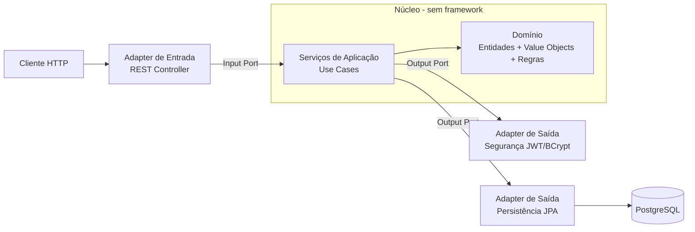

# Relatório Técnico — Tech Challenge Fase 1
## Sistema de Gestão de Restaurantes — Arquitetura Hexagonal (Ports & Adapters)

**Alunos:** [preencher com os integrantes do grupo]
**Curso:** Pós-Tech — Arquitetura e Desenvolvimento Java
**Stack:** Java 21 · Spring Boot 3.5.x · PostgreSQL · Docker
**Arquitetura:** Hexagonal (Ports & Adapters) orientada aos princípios SOLID
**Versão do relatório:** 1.0

> Documento vivo, organizado pelas etapas de desenvolvimento. Cada etapa corresponde a um
> elemento da arquitetura hexagonal e é validada pelos princípios SOLID.

---

## Sumário de Progresso

| # | Etapa | Camada hexagonal | Status |
|---|-------|------------------|--------|
| 1 | Setup do Projeto e Estrutura Hexagonal | — | ✅ |
| 2 | Modelagem do Domínio (núcleo) | Domínio | ✅ |
| 3 | Ports de Entrada (Casos de Uso) | Aplicação | ✅ |
| 4 | Ports de Saída | Aplicação | ✅ |
| 5 | Serviços de Aplicação (Use Cases) | Aplicação | ✅ |
| 6 | Adapter de Persistência + Migrations/Seeds | Adapter de saída | ✅ |
| 7 | Adapter Web de Entrada (REST) | Adapter de entrada | ✅ |
| 8 | Adapter de Segurança (JWT/BCrypt) | Adapter de saída | ✅ |
| 9 | Tratamento de Erros (ProblemDetail) | Adapter de entrada | ✅ |
| 10 | Documentação Swagger | Adapter de entrada | ✅ |
| 11 | Execução com Docker Compose | — | ✅ |
| 12 | Testes (domínio, use cases, ArchUnit) | Transversal | ✅ |
| 13 | Entregáveis (Postman, README) | — | ✅ |

**Legenda:** ✅ concluída · 🔄 em andamento · ⏳ pendente.

---

## Mapa dos Entregáveis Obrigatórios

| Entregável obrigatório | Onde encontrar |
|------------------------|----------------|
| Descrição detalhada da arquitetura | Visão Geral da Arquitetura |
| Modelagem das entidades e relacionamentos | Etapa 2 |
| Estrutura do banco de dados (tabelas) | Etapa 6 |
| Descrição dos endpoints (com exemplos) | Etapas 7 e 8 |
| Documentação Swagger | Etapa 10 |
| Coleção Postman | Etapa 13 |
| Passo a passo com Docker Compose | Etapa 11 |

---

## Visão Geral da Arquitetura

### Por que arquitetura hexagonal

A **Arquitetura Hexagonal (Ports & Adapters)**, proposta por Alistair Cockburn, isola as
regras de negócio de tudo que é detalhe de infraestrutura (banco, web, frameworks). O
sistema é visto como um **núcleo** (o hexágono) que se comunica com o mundo externo apenas
através de **portas** (interfaces), enquanto **adaptadores** conectam essas portas às
tecnologias concretas.

A escolha se justifica pelo objetivo pedagógico e prático da fase: demonstrar um domínio
independente de framework, testável isoladamente e aberto a troca de tecnologias sem
reescrever regras de negócio. É a materialização direta do **Princípio da Inversão de
Dependência (DIP)**: o núcleo não depende de detalhes; os detalhes é que dependem do núcleo.

### Anatomia do hexágono

| Região | Pacote | Responsabilidade | Conhece framework? |
|--------|--------|------------------|--------------------|
| **Domínio** | `domain` | Entidades de domínio, Value Objects e regras de negócio puras | Não |
| **Aplicação** | `application` | Casos de uso (input ports), contratos de infraestrutura (output ports) e serviços que os orquestram | Não |
| **Adapters de entrada** | `adapter.in` | Controllers REST, VOs de contrato, tratamento de erros, Swagger | Sim |
| **Adapters de saída** | `adapter.out` | Persistência (JPA), segurança (BCrypt/JWT) | Sim |

**Portas (interfaces):**
- **Input ports (dirigem o núcleo):** um contrato por caso de uso — `RegisterUserUseCase`,
  `UpdateUserUseCase`, `ChangePasswordUseCase`, `DeleteUserUseCase`, `FindUserUseCase`,
  `AuthenticateUseCase`.
- **Output ports (dirigidos pelo núcleo):** contratos que o núcleo exige do mundo externo —
  `LoadUserPort`, `SaveUserPort`, `CheckUserExistsPort`, `LoadRolePort`,
  `PasswordEncoderPort`, `TokenProviderPort`.

### A regra de dependência

Todas as setas de dependência apontam **para dentro**, em direção ao domínio. Os adapters
dependem dos ports (interfaces da aplicação); o domínio não conhece nenhum adapter. A
injeção de dependência do Spring conecta cada porta à sua implementação em tempo de
execução — mas o núcleo permanece agnóstico.



### Como os princípios SOLID se materializam

- **SRP** — cada adapter e cada serviço de caso de uso têm uma única razão para mudar.
- **OCP** — trocar de banco ou de mecanismo de token significa escrever um novo adapter,
  sem tocar no domínio.
- **LSP** — qualquer implementação de um port é substituível (ex.: um adapter em memória
  nos testes substitui o adapter JPA).
- **ISP** — os ports são segregados por intenção (`LoadUserPort` e `SaveUserPort` separados,
  não um repositório monolítico); cada caso de uso é um port pequeno.
- **DIP** — o domínio depende de abstrações (ports), nunca de implementações. Esta é a
  espinha dorsal do hexágono. (Detalhamento na seção *Princípios SOLID Aplicados*.)

---

## Etapa 1 — Setup do Projeto e Estrutura Hexagonal

### Stack

| Tecnologia | Uso |
|------------|-----|
| Java 21 (LTS) · Spring Boot 3.5.x | Linguagem e framework base |
| Spring Web | Adapter de entrada REST |
| Spring Data JPA · PostgreSQL · Flyway | Adapter de persistência e schema |
| Spring Security · jjwt | Adapter de segurança (JWT) |
| Bean Validation | Validação nos VOs de contrato |
| springdoc-openapi | Swagger (adapter de entrada) |
| MapStruct | Mapeamento entre domínio, VOs de web e entidades JPA |
| JUnit 5 · Mockito · ArchUnit | Testes e verificação da arquitetura |

### Estrutura de pacotes (por arquitetura, não por camada técnica)

```
com.postech.restaurantes
├── domain/                      # NÚCLEO — sem dependências de framework
│   ├── model/                   # User, Role, Address (entidades de domínio puras)
│   ├── vo/                      # Email, ZipCode (Value Objects)
│   └── exception/               # exceções de domínio
├── application/
│   ├── port/
│   │   ├── in/                  # Input Ports: casos de uso (interfaces)
│   │   └── out/                 # Output Ports: contratos de infraestrutura (interfaces)
│   └── service/                 # Serviços de aplicação (implementam os input ports)
└── adapter/
    ├── in/
    │   └── web/                 # Controllers REST, VOs request/response, ProblemDetail, Swagger
    └── out/
        ├── persistence/         # JPA entities, Spring Data repos, adapter dos output ports
        └── security/            # BCrypt e JWT como adapters dos output ports
```

A organização **por arquitetura** (domínio / aplicação / adapters) — e não por camada
técnica (controller / service / repository) — torna as fronteiras do hexágono explícitas no
próprio código e facilita a verificação automatizada por ArchUnit (Etapa 12).

---

## Etapa 2 — Modelagem do Domínio (núcleo)

O domínio é composto por **entidades de domínio puras** (POJOs, sem anotações de JPA ou de
qualquer framework) e por **Value Objects**. As regras de negócio residem aqui.

### Entidades e relacionamentos

| Entidade | Descrição | Relacionamentos |
|----------|-----------|-----------------|
| `User` | Identidade e credenciais | 1:N com `Address`; N:M com `Role` |
| `Role` | Papel de autorização (`ROLE_OWNER`, `ROLE_CUSTOMER`, `ROLE_ADMIN`) | N:M com `User` |
| `Address` | Endereço do usuário | N:1 com `User` |

Os dois tipos de usuário exigidos (dono de restaurante e cliente) são modelados como
**papéis**, o que permite acumular papéis e alimenta a autorização do adapter de segurança.

### Value Objects

`Email` e `ZipCode` encapsulam invariantes e **normalizam** os dados no domínio — o `Email`
para minúsculas (o que torna a regra de e-mail único correta) e o `ZipCode` para 8 dígitos.
Sendo do domínio, não conhecem Jackson nem JPA.

```java
public record Email(String value) {
    public Email {
        value = value == null ? null : value.trim().toLowerCase();
        if (value == null || !value.matches("^[\\w.+-]+@[\\w-]+\\.[\\w.-]+$"))
            throw new InvalidEmailException(value);
    }
}
```

A entidade de domínio registra `createdAt` (imutável) e `lastUpdatedAt`, atendendo ao
requisito de data da última alteração — a atualização desse campo é regra de domínio,
disparada pelo caso de uso, não um efeito colateral do ORM.

---

## Etapa 3 — Ports de Entrada (Casos de Uso)

Os **input ports** são interfaces que expressam o que a aplicação faz, no vocabulário do
negócio. Cada caso de uso é um port pequeno e coeso (ISP), recebendo *comandos* imutáveis.

```java
public interface RegisterUserUseCase {
    UserView register(RegisterUserCommand command);
}

public interface ChangePasswordUseCase {
    void changePassword(ChangePasswordCommand command);
}
```

Casos de uso previstos: `RegisterUserUseCase`, `UpdateUserUseCase`, `ChangePasswordUseCase`,
`DeleteUserUseCase`, `FindUserUseCase` e `AuthenticateUseCase`. Separar a troca de senha em
seu próprio caso de uso atende, já no desenho, ao requisito de **endpoint exclusivo de
senha** distinto da atualização dos demais dados.

Os *commands* (ex.: `RegisterUserCommand`) são objetos de entrada do núcleo — imutáveis e
independentes do formato HTTP; a conversão do JSON para command acontece no adapter web.

---

## Etapa 4 — Ports de Saída

Os **output ports** são interfaces que o núcleo exige do mundo externo. São segregados por
intenção (ISP) e implementados pelos adapters de saída (Etapas 6 e 8).

| Output Port | Responsabilidade | Adapter que implementa |
|-------------|------------------|------------------------|
| `LoadUserPort` | carregar usuário por id, login ou e-mail | Persistência (JPA) |
| `SaveUserPort` | persistir/atualizar usuário | Persistência (JPA) |
| `CheckUserExistsPort` | verificar unicidade de e-mail/login | Persistência (JPA) |
| `LoadRolePort` | resolver papéis por nome | Persistência (JPA) |
| `PasswordEncoderPort` | gerar/conferir hash de senha | Segurança (BCrypt) |
| `TokenProviderPort` | emitir/validar token | Segurança (JWT) |

```java
public interface LoadUserPort {
    Optional<User> findById(Long id);
    Optional<User> findByLogin(String login);
    Page<User> searchByName(String name, PageQuery pageQuery);
}
```

O núcleo declara `PasswordEncoderPort` e `TokenProviderPort` como abstrações próprias — não
importa `PasswordEncoder` do Spring Security. Assim o domínio não sabe que a senha usa
BCrypt nem que o token é JWT: são decisões dos adapters (DIP e OCP).

---

## Etapa 5 — Serviços de Aplicação (Use Cases)

Os **serviços de aplicação** implementam os input ports e orquestram as regras usando
apenas os output ports. Não contêm SQL, HTTP nem detalhe de framework — apenas coordenação
de domínio.

```java
@Service
class RegisterUserService implements RegisterUserUseCase {

    private final LoadUserPort loadUserPort;
    private final SaveUserPort saveUserPort;
    private final CheckUserExistsPort checkUserExistsPort;
    private final LoadRolePort loadRolePort;
    private final PasswordEncoderPort passwordEncoder;

    // construtor com injeção das portas

    @Override
    public UserView register(RegisterUserCommand command) {
        Email email = new Email(command.email());               // normaliza + valida
        if (checkUserExistsPort.existsByEmail(email.value()))
            throw new DuplicateEmailException(email.value());
        if (checkUserExistsPort.existsByLogin(command.login()))
            throw new DuplicateLoginException(command.login());

        Set<Role> roles = loadRolePort.resolve(command.roles());
        String hash = passwordEncoder.encode(command.rawPassword());

        User user = User.newUser(command.name(), email, command.login(), hash, roles,
                                 command.addresses());
        return UserView.from(saveUserPort.save(user));
    }
}
```

O serviço depende de **interfaces**, nunca de implementações — é testável com mocks dos
ports, sem subir Spring nem banco (Etapa 12). A regra de e-mail único funciona porque o VO
`Email` normaliza antes da checagem de existência.

---

## Etapa 6 — Adapter de Persistência + Migrations/Seeds

O adapter de saída de persistência implementa os output ports de dados. Ele contém as
**entidades JPA** (separadas das entidades de domínio), os repositórios Spring Data e um
**mapper domínio ↔ JPA** (MapStruct).

```java
@Component
class UserPersistenceAdapter implements LoadUserPort, SaveUserPort, CheckUserExistsPort {

    private final UserJpaRepository repository;
    private final UserPersistenceMapper mapper;

    @Override
    public User save(User user) {
        return mapper.toDomain(repository.save(mapper.toJpa(user)));
    }

    @Override
    public boolean existsByEmail(String email) {
        return repository.existsByEmail(email);
    }
    // ...
}
```

**Decisão — separar entidade de domínio da entidade JPA.** A `User` de domínio é um POJO
puro; a `UserJpaEntity` carrega as anotações do ORM. O custo é um mapeamento a mais; o
ganho é um domínio livre de acoplamento com o JPA (o framework não vaza para o núcleo).
É a aplicação consciente do DIP e do SRP.

### Estrutura do banco de dados (tabelas)

Schema versionado com **Flyway** (`ddl-auto: validate`; migrations imutáveis). Modelo
normalizado até 3FN/BCNF.

```sql
CREATE TABLE users (
    id              BIGINT GENERATED ALWAYS AS IDENTITY PRIMARY KEY,
    name            VARCHAR(255) NOT NULL,
    email           VARCHAR(255) NOT NULL UNIQUE,
    login           VARCHAR(255) NOT NULL UNIQUE,
    password        VARCHAR(255) NOT NULL,
    created_at      TIMESTAMP    NOT NULL,
    last_updated_at TIMESTAMP    NOT NULL
);
CREATE TABLE roles (
    id   BIGINT GENERATED ALWAYS AS IDENTITY PRIMARY KEY,
    name VARCHAR(50) NOT NULL UNIQUE
);
CREATE TABLE user_roles (
    user_id BIGINT NOT NULL REFERENCES users (id) ON DELETE CASCADE,
    role_id BIGINT NOT NULL REFERENCES roles (id) ON DELETE CASCADE,
    PRIMARY KEY (user_id, role_id)
);
CREATE TABLE addresses (
    id           BIGINT GENERATED ALWAYS AS IDENTITY PRIMARY KEY,
    user_id      BIGINT       NOT NULL REFERENCES users (id) ON DELETE CASCADE,
    street       VARCHAR(255) NOT NULL, number VARCHAR(255), complement VARCHAR(255),
    neighborhood VARCHAR(255), city VARCHAR(255) NOT NULL,
    state        VARCHAR(2)   NOT NULL, zip_code VARCHAR(9) NOT NULL
);
```

Migrations: `V1` cria o schema e faz seed dos papéis; `V2` faz seed de usuários de
demonstração (senhas em hash BCrypt real). Migrations aplicadas são imutáveis — toda
mudança futura é uma nova versão.

---

## Etapa 7 — Adapter Web de Entrada (REST)

O adapter de entrada web expõe os casos de uso via REST. O controller **depende dos input
ports**, nunca dos serviços concretos, e converte VOs de contrato ↔ commands/views.

```java
@RestController
@RequestMapping("/api/v1/users")
class UserRestController {

    private final RegisterUserUseCase registerUserUseCase;
    private final ChangePasswordUseCase changePasswordUseCase;
    // demais casos de uso...

    @PostMapping
    ResponseEntity<UserResponse> register(@Valid @RequestBody UserRegistrationRequest req) {
        UserView view = registerUserUseCase.register(req.toCommand());
        return ResponseEntity.created(...).body(UserResponse.from(view));
    }
}
```

Os **VOs de contrato** (`UserRegistrationRequest`, `UserResponse`, etc.) são `record`
imutáveis, validados com Bean Validation, versionados sob `v1`. A senha nunca aparece em um
VO de saída. Endpoints:

| Método | Rota | Caso de uso | Requisito atendido |
|--------|------|-------------|--------------------|
| `POST` | `/api/v1/users` | RegisterUser | cadastro (público) |
| `GET` | `/api/v1/users/{id}` | FindUser | consulta |
| `GET` | `/api/v1/users?name=` | FindUser | busca por nome (paginada) |
| `PUT` | `/api/v1/users/{id}` | UpdateUser | atualização de dados (endpoint distinto) |
| `PATCH` | `/api/v1/users/{id}/password` | ChangePassword | troca de senha (endpoint exclusivo) |
| `DELETE` | `/api/v1/users/{id}` | DeleteUser | exclusão |
| `POST` | `/api/v1/auth/login` | Authenticate | validação de login |

Versionamento por path (`/api/v1`). A separação entre `PUT` (dados) e `PATCH .../password`
(senha) reflete, no adapter, a separação já existente entre os casos de uso.

---

## Etapa 8 — Adapter de Segurança (JWT/BCrypt)

A segurança entra como **adapters de saída** que implementam os ports do núcleo, mais a
configuração do Spring Security no adapter de entrada.

- `BCryptPasswordAdapter implements PasswordEncoderPort` — encapsula o BCrypt.
- `JwtTokenAdapter implements TokenProviderPort` — emite/valida o JWT (HMAC-SHA256).
- `AuthenticateService implements AuthenticateUseCase` — valida credenciais via
  `LoadUserPort` + `PasswordEncoderPort` e emite o token via `TokenProviderPort`.

Assim, o caso de uso de autenticação é **agnóstico**: não sabe que o hash é BCrypt nem que
o token é JWT — poderia trocar para Argon2 ou PASETO apenas escrevendo novos adapters (OCP).
A API é stateless; o filtro JWT autentica cada requisição no adapter de entrada. Segredo e
expiração vêm de variáveis de ambiente (segredo ≥ 256 bits).

**Exemplo — login** (`POST /api/v1/auth/login`) → `200 OK`:

```json
{ "token": "eyJhbGciOiJIUzI1NiJ9...", "type": "Bearer", "expiresIn": 3600000 }
```

Endpoints públicos: login, auto-cadastro (`POST /users`), Swagger e health; o restante
exige token.

---

## Etapa 9 — Tratamento de Erros (ProblemDetail)

No adapter de entrada web, um `@RestControllerAdvice` traduz as **exceções de domínio** em
respostas **ProblemDetail (RFC 7807)**. O domínio lança exceções de negócio; o adapter é
quem conhece HTTP e faz o mapeamento — separação de responsabilidades entre núcleo e borda.

| Exceção de domínio/aplicação | HTTP |
|------------------------------|------|
| `UserNotFoundException` / `RoleNotFoundException` | 404 |
| `DuplicateEmailException` / `DuplicateLoginException` | 409 |
| `InvalidPasswordException` / validação de VO | 400 |
| falha de autenticação | 401 |

```json
{
  "type": "about:blank", "title": "Conflito de dados", "status": 409,
  "detail": "Já existe um usuário com o e-mail joao@email.com",
  "timestamp": "2026-06-28T10:00:00Z"
}
```

---

## Etapa 10 — Documentação Swagger

Documentação OpenAPI (springdoc) gerada a partir do adapter web, com o esquema de segurança
**Bearer JWT** (botão *Authorize* no Swagger UI). Swagger UI em `/swagger-ui.html`;
OpenAPI JSON em `/v3/api-docs`. Por estar no adapter de entrada, a documentação não
contamina o núcleo.

---

## Etapa 11 — Execução com Docker Compose

Orquestração de aplicação + banco via Docker Compose.

```bash
cp .env.example .env          # variáveis (banco, JWT_SECRET, JWT_EXPIRATION)
docker compose up --build     # sobe app + PostgreSQL
docker compose down           # encerra (use -v para apagar os dados)
```

Aplicação em `http://localhost:8080`; Swagger em `http://localhost:8080/swagger-ui.html`.
Variáveis externas: `DB_NAME`, `DB_USER`, `DB_PASSWORD`, `DB_HOST`, `DB_PORT`,
`JWT_SECRET`, `JWT_EXPIRATION`.

---

## Etapa 12 — Testes (domínio, use cases, ArchUnit)

A arquitetura hexagonal torna os testes naturais e rápidos:

- **Domínio** — testado isoladamente, sem Spring: invariantes dos Value Objects (ex.:
  normalização e rejeição de e-mail inválido) e regras das entidades.
- **Casos de uso** — testados com **mocks dos output ports** (JUnit 5 + Mockito). Como o
  serviço depende de interfaces, não é preciso subir banco nem contexto Spring. Cobrem
  cadastro, e-mail/login duplicado, troca de senha (senha atual incorreta e confirmação
  divergente) e consultas.
- **ArchUnit** — verifica automaticamente as **regras do hexágono**: o pacote `domain` não
  depende de `application` nem de `adapter`; `application` não depende de `adapter`; e os
  adapters só acessam o núcleo através dos ports. Isso protege a arquitetura contra erosão.

```java
@ArchTest
static final ArchRule dominio_nao_depende_de_frameworks =
    noClasses().that().resideInAPackage("..domain..")
        .should().dependOnClassesThat()
        .resideInAnyPackage("..adapter..", "org.springframework..", "jakarta.persistence..");
```

---

## Etapa 13 — Entregáveis (Postman, README)

- **Coleção Postman** (`v2.1`, variáveis `{{baseUrl}}`/`{{token}}`; o login salva o token
  automaticamente): login (válido/inválido), cadastro válido, cadastro inválido (campos
  faltando e e-mail duplicado), busca por nome paginada, consulta, atualização (sucesso e
  erro), troca de senha (sucesso e erro) e exclusão.
- **README** do repositório: stack, execução com Docker, variáveis, fluxo de autenticação,
  tabela de endpoints, Swagger, Postman e execução dos testes.

---

## Princípios SOLID Aplicados

Mapeamento explícito de cada princípio à arquitetura hexagonal deste projeto.

- **S — Responsabilidade Única.** O domínio cuida só de regras; cada caso de uso resolve uma
  intenção; cada adapter fala com uma tecnologia. Ex.: `UserPersistenceAdapter` só traduz
  domínio ↔ JPA; a tradução para HTTP é do adapter web.
- **O — Aberto/Fechado.** Estender = adicionar adapter. Trocar BCrypt por Argon2, ou JWT por
  outro formato, ou PostgreSQL por outro banco, não exige alterar o núcleo — basta um novo
  adapter implementando o mesmo port.
- **L — Substituição de Liskov.** Toda implementação de um port honra seu contrato e é
  intercambiável. Nos testes, um adapter em memória substitui o adapter JPA sem que o caso
  de uso perceba.
- **I — Segregação de Interfaces.** Ports pequenos e focados: `LoadUserPort`, `SaveUserPort`
  e `CheckUserExistsPort` são separados em vez de um repositório monolítico; cada caso de
  uso é uma interface própria. Nenhum cliente depende de métodos que não usa.
- **D — Inversão de Dependência.** O núcleo define abstrações (input e output ports) e os
  adapters dependem delas — nunca o contrário. As setas de dependência apontam para o
  domínio. É o princípio que estrutura toda a arquitetura hexagonal.

---

## Decisões Técnicas (registro consolidado)

- **Arquitetura Hexagonal (Ports & Adapters)**: núcleo isolado, dependências apontando para
  dentro; organização de pacotes por arquitetura (domínio/aplicação/adapters).
- **Domínio livre de framework**: entidades de domínio separadas das entidades JPA, com
  mapeamento dedicado (MapStruct). Custo de mapeamento aceito em troca de independência.
- **Ports segregados por intenção** (ISP): input ports por caso de uso; output ports
  específicos (load/save/exists/encoder/token).
- **Objetos de transferência como Value Objects** (`record` imutáveis) nos contratos web.
  VOs de valor (`Email`, `ZipCode`) no domínio, com
  normalização que sustenta a regra de e-mail único.
- **Persistência**: Spring Data JPA + Flyway (schema versionado, migrations imutáveis).
- **Segurança**: JWT stateless + BCrypt, ambos como adapters de output ports (núcleo
  agnóstico ao mecanismo).
- **Erros**: ProblemDetail (RFC 7807) no adapter de entrada.
- **Versionamento de API por path** (`/api/v1`), refletido nos VOs de contrato.
- **Verificação de arquitetura** com ArchUnit, garantindo a regra de dependência do hexágono.

---

## Referências Bibliográficas

- COCKBURN, Alistair. *Hexagonal Architecture (Ports and Adapters)*. Isolamento do núcleo de
  aplicação de interfaces e infraestrutura.
- MARTIN, Robert C. *Arquitetura Limpa (Clean Architecture)*. Regra de dependência,
  fronteiras e os princípios SOLID.
- MARTIN, Robert C. *Código Limpo (Clean Code)*. Boas práticas de codificação e SOLID.
- DATE, C. J. *Introdução a Sistemas de Bancos de Dados*. Modelo relacional e formas normais.
- MACHADO, Felipe Nery Rodrigues. *Banco de Dados: Projeto e Implementação*. Projeto de
  banco em três níveis e modelo entidade-relacionamento.
