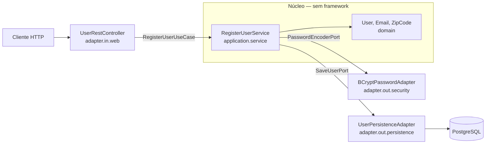

# Relatório Técnico — Tech Challenge Fase 1
## Sistema de Gestão de Restaurantes — Arquitetura Hexagonal (Ports & Adapters)

**Alunos:** [preencher com os integrantes do grupo]
**Curso:** Pós-Tech — Arquitetura e Desenvolvimento Java
**Stack:** Java 21 · Spring Boot 3.5.x · PostgreSQL · Docker
**Arquitetura:** Hexagonal (Ports & Adapters) orientada aos princípios SOLID
**Versão do relatório:** 2.0

> **Sobre esta versão.** A v1.0 descrevia um projeto planejado: marcava as treze etapas como
> concluídas quando existia apenas o esqueleto de pacotes e um modelo de domínio parcial, e
> documentava decisões (Spring Data JPA, MapStruct, Lombok, ids `BIGINT`) que a variante em
> camadas já havia revertido. Esta v2.0 descreve **o que foi efetivamente construído e
> verificado**: 80 testes automatizados passando e a aplicação exercitada end-to-end sobre
> Docker. Onde uma decisão tem custo, o custo está registrado.

---

## Sumário de Progresso

| # | Sprint | Anel do hexágono | Status |
|---|--------|------------------|--------|
| 0 | Build e infraestrutura | — | ✅ |
| 1 | Domínio puro | Núcleo | ✅ |
| 2 | Ports de entrada (casos de uso) | Aplicação | ✅ |
| 3 | Ports de saída | Aplicação | ✅ |
| 4 | Serviços de aplicação | Aplicação | ✅ |
| 5 | Adapter de persistência + migrations | Adapter de saída | ✅ |
| 6 | Adapters de segurança e e-mail | Adapter de saída | ✅ |
| 7 | Adapter web REST | Adapter de entrada | ✅ |
| 8 | Testes e verificação de arquitetura | Transversal | ✅ |
| 9 | Relatório, README e Postman | — | ✅ |

O detalhamento de escopo e critérios de aceite de cada sprint está em
[`plano-de-sprints.md`](plano-de-sprints.md).

---

## Mapa dos Entregáveis Obrigatórios

| Entregável obrigatório | Onde encontrar |
|------------------------|----------------|
| Descrição detalhada da arquitetura | *Visão Geral da Arquitetura* |
| Modelagem das entidades e relacionamentos | *O Domínio* |
| Estrutura do banco de dados (tabelas) | *O Adapter de Persistência* |
| Descrição dos endpoints (com exemplos) | *O Adapter Web* |
| Documentação Swagger | *Documentação da API* |
| Coleção Postman | `hexagonal/restaurantes/postman/` |
| Passo a passo com Docker Compose | *Execução* |

---

## Visão Geral da Arquitetura

### Por que arquitetura hexagonal

A **Arquitetura Hexagonal (Ports & Adapters)**, proposta por Alistair Cockburn, isola as
regras de negócio de tudo que é detalhe de infraestrutura. O sistema é um **núcleo** que se
comunica com o mundo externo apenas através de **portas** (interfaces), enquanto
**adaptadores** conectam essas portas às tecnologias concretas.

A escolha se justifica pelo objetivo desta fase: demonstrar um domínio independente de
framework, testável isoladamente e aberto a troca de tecnologias sem reescrever regras de
negócio. É a materialização direta do **Princípio da Inversão de Dependência**: o núcleo não
depende de detalhes; os detalhes é que dependem do núcleo.

### A comparação com a variante em camadas

Este projeto é a segunda implementação dos mesmos requisitos — a primeira está em
[`camadas/restaurantes/`](../../camadas/restaurantes/). Para que a comparação signifique
alguma coisa, **a stack das duas é deliberadamente idêntica**: Java 21, JDBC puro com
`JdbcTemplate`, sem Lombok e sem MapStruct, PostgreSQL, Flyway, JWT, ids em UUID.

Isso foi uma correção de rumo. O esqueleto original do hexagonal previa Spring Data JPA,
MapStruct e Lombok, enquanto a variante em camadas havia migrado para JDBC e Java puro. Se
as duas tivessem stacks diferentes, qualquer diferença observada — em legibilidade, em
esforço de teste, em acoplamento — poderia ser atribuída à troca de tecnologia em vez do
desenho arquitetural. **Com a stack fixa, a única variável é a arquitetura.**

### Anatomia do hexágono

| Região | Pacote | Responsabilidade | Conhece framework? |
|--------|--------|------------------|--------------------|
| **Domínio** | `domain` | Entidades, Value Objects e regras de negócio | **Não** |
| **Aplicação** | `application` | Casos de uso (input ports), contratos de infraestrutura (output ports) e os serviços que os orquestram | **Não** |
| **Adapters de entrada** | `adapter.in` | Controllers REST, DTOs, tratamento de erros, filtro JWT | Sim |
| **Adapters de saída** | `adapter.out` | Persistência (JDBC), segurança (BCrypt/JWT), e-mail (SMTP) | Sim |
| **Raiz de composição** | `config` | Liga cada porta à sua implementação | Sim |

```
com.postech.restaurantes
├── RestaurantesApplication.java
├── domain/                        # NÚCLEO — Java puro, zero dependências externas
│   ├── model/                     # User, Address, Role, PasswordResetToken
│   │   └── shared/                # Email, ZipCode (Value Objects)
│   ├── exception/                 # DomainException e descendentes
│   └── util/                      # ObjectUtils, TextUtils
├── application/                   # também sem framework
│   ├── pagination/                # PageQuery, PageResult (paginação própria)
│   ├── port/in/                   # casos de uso + commands + views
│   ├── port/out/                  # contratos de infraestrutura
│   └── service/                   # implementações dos casos de uso
├── adapter/
│   ├── in/web/                    # controllers, DTOs v1, ProblemDetail, HATEOAS, JWT filter
│   └── out/
│       ├── persistence/           # JDBC + transação
│       ├── security/              # BCrypt, JWT, token de reset, auditor
│       └── mail/                  # SMTP
└── config/                        # raiz de composição (@Bean dos casos de uso, Security, OpenAPI)
```

### O fluxo de uma requisição



O controller depende de `RegisterUserUseCase` — uma interface. O serviço depende de
`SaveUserPort` e `PasswordEncoderPort` — interfaces. Nenhuma seta sai do núcleo em direção a
uma classe concreta de infraestrutura. Quem une as pontas em tempo de execução é a
`UseCaseConfiguration`.

---

## O Domínio

O domínio é composto por entidades puras e Value Objects. É onde as regras vivem.

### Entidades e relacionamentos

| Entidade | Descrição | Relacionamentos |
|----------|-----------|-----------------|
| `User` | Raiz do agregado: identidade e credenciais | 1:N com `Address`; N:M com `Role` |
| `Address` | Endereço do usuário | pertence ao agregado de `User` |
| `Role` | Papel de autorização | N:M com `User` |
| `PasswordResetToken` | Token de uso único, com expiração | referencia `User` pelo id |

Os dois tipos de usuário exigidos (dono de restaurante e cliente) são modelados como
**papéis**, não como subclasses: um mesmo usuário pode acumular papéis, e a autorização lê
essa lista diretamente.

### Encapsulamento como regra, não como estilo

A entidade `User` **não tem setters públicos**. O estado só muda por métodos que expressam
intenção:

```java
public void updateProfile(String name, Email email, String login) { ...; touch(); }
public void changePassword(String newPasswordHash)                { ...; touch(); }
public void replaceAddresses(List<Address> newAddresses)          { ...; touch(); }
```

O `touch()` privado registra a data da última alteração. Com setters, cada chamador
precisaria lembrar de atualizá-la e um esquecimento passaria despercebido; assim, **é
impossível alterar o usuário sem registrar quando**. A fase exige esse campo — aqui ele é
uma invariante da entidade, não uma convenção.

Repare também no que `updateProfile` **não** aceita: senha. A separação entre
`PUT /users/{id}` e `PATCH /users/{id}/password` começa no tipo do domínio; a rota é
consequência, não causa.

### Value Objects

`Email` e `ZipCode` encapsulam invariantes e **normalizam** na construção.

```java
public record Email(String value) {
    private static final Pattern PATTERN = Pattern.compile("^[\\w.+-]+@[\\w-]+\\.[\\w.-]+$");

    public Email {
        value = TextUtils.toLowerNormalized(value);
        if (value == null || value.isBlank())      throw InvalidEmailException.required();
        if (!PATTERN.matcher(value).matches())     throw InvalidEmailException.malformed(value);
    }
}
```

A normalização não é cosmética: é ela que **sustenta a regra de e-mail único**. Sem ela,
`Joao@Email.com` e `joao@email.com` seriam registros distintos e a mesma pessoa se
cadastraria duas vezes variando a caixa das letras. Isso foi verificado end-to-end: cadastrar
`Joana@Email.COM` e depois tentar `JOANA@email.com` devolve **409**.

`ZipCode` guarda os 8 dígitos crus e formata sob demanda — dois CEPs iguais escritos de
formas diferentes não viram registros diferentes.

### Duas correções em relação ao esqueleto original

- **`User.newUser` era método de instância**, o que o tornava inutilizável como fábrica
  (seria preciso ter um `User` para criar um `User`). Agora é `static`.
- **`Address` referenciava `User` de volta.** Foi removido: chave estrangeira é vocabulário
  de banco. Quem conhece `addresses.user_id` é o adapter de persistência — manter isso no
  domínio é precisamente o vazamento de infraestrutura que o hexágono evita.

---

## Ports de Entrada — os casos de uso

Um input port por caso de uso, cada um recebendo um *command* imutável:

```java
public interface RegisterUserUseCase { UserView register(RegisterUserCommand command); }
public interface ChangePasswordUseCase { void changePassword(ChangePasswordCommand command); }
```

Casos de uso: `RegisterUser`, `UpdateUser`, `ChangePassword`, `DeleteUser`, `FindUser`,
`Authenticate`, `RequestPasswordReset`, `ResetPassword`.

**Commands e views** são a fronteira. Os commands são objetos de entrada independentes de
HTTP — um segundo adapter (CLI, consumidor de fila) chamaria o mesmo caso de uso montando o
mesmo command. As views são a saída: devolver a entidade `User` daria ao adapter web acesso
a `changePassword()` e faria qualquer mudança no domínio virar mudança no contrato público.
A `UserView` também **não carrega o hash da senha** — nenhum adapter tem a chance de vazá-lo.

**Paginação própria.** `PageQuery` e `PageResult` existem para o núcleo não importar
`Pageable`/`Page` do Spring Data. O `PageQuery` também impõe um teto de 100 itens: sem ele,
`?size=1000000` seria um pedido para carregar a tabela em memória.

---

## Ports de Saída

| Output Port | Responsabilidade | Adapter que implementa |
|-------------|------------------|------------------------|
| `LoadUserPort` | ler usuário por id, login, e-mail; listar e buscar | Persistência (JDBC) |
| `SaveUserPort` | gravar o agregado | Persistência (JDBC) |
| `DeleteUserPort` | excluir | Persistência (JDBC) |
| `CheckUserExistsPort` | unicidade de e-mail/login | Persistência (JDBC) |
| `LoadRolePort` | resolver papéis por nome | Persistência (JDBC) |
| `PasswordEncoderPort` | gerar/conferir hash | Segurança (BCrypt) |
| `TokenProviderPort` | emitir token | Segurança (JWT) |
| `TokenVerifierPort` | verificar token | Segurança (JWT) |
| `ResetTokenGeneratorPort` | gerar/hashear token de reset | Segurança (SecureRandom + SHA-256) |
| `LoadPasswordResetTokenPort` / `SavePasswordResetTokenPort` | tokens de reset | Persistência (JDBC) |
| `SendPasswordResetMailPort` | notificar o usuário | E-mail (SMTP) |
| `AuditorPort` | autor da gravação | Segurança (SecurityContext) |
| `TransactionPort` | delimitar unidade atômica | Persistência (TransactionTemplate) |

O núcleo declara `PasswordEncoderPort` em vez de importar o `PasswordEncoder` do Spring.
É a diferença entre *"a aplicação precisa transformar senha em hash"* (regra) e *"a aplicação
usa BCrypt do Spring"* (detalhe).

### `TransactionPort` — a decisão menos óbvia do projeto

Como os serviços de aplicação não têm anotações, `@Transactional` está fora de questão.
Havia duas saídas:

1. **Transação dentro do adapter de persistência.** Resolve os casos que tocam uma tabela só,
   mas não os que coordenam dois ports. Redefinir a senha grava o usuário *e* marca o token
   como usado; falhar entre as duas coisas deixaria um token gasto sem senha nova.
2. **Um port explícito.** Quem sabe que duas gravações formam uma unidade é o caso de uso —
   então é ele quem a delimita. O *como* continua no adapter.

Optou-se pela segunda. O custo é uma indireção a mais nos serviços; o ganho aparece no teste,
onde a implementação inteira cabe em quatro linhas:

```java
class DirectTransactionPort implements TransactionPort {
    @Override public <T> T inTransaction(Supplier<T> action) { return action.get(); }
}
```

### Dois ports que nenhum caso de uso chama

`AuditorPort` e `TokenVerifierPort` são consumidos por **adapters**, não pelo núcleo. A
alternativa seria o adapter de persistência ler o `SecurityContextHolder` diretamente e o
filtro web depender do adapter de JWT — em ambos os casos, **um adapter passaria a conhecer
o outro**. Declará-los como ports mantém os adapters se falando apenas pelo vocabulário da
aplicação. É uma concessão consciente à pureza conceitual (um port deveria nascer de uma
necessidade do núcleo) em troca de um desacoplamento real entre bordas.

Note ainda o que **não** virou port: `createdBy`/`lastUpdatedBy` não existem no domínio. São
metadados de infraestrutura sobre a linha gravada, não fatos de negócio sobre o usuário. Já
`createdAt`/`lastUpdatedAt` são regra — a fase os exige — e por isso vivem na entidade.

---

## Serviços de Aplicação

Implementam os input ports orquestrando apenas output ports.

```java
public class RegisterUserService implements RegisterUserUseCase {

    // construtor recebe apenas ports

    @Override
    public UserView register(RegisterUserCommand command) {
        ensureSelfRegistrationRolesAllowed(command.roles());

        Email email = new Email(command.email());   // normaliza ANTES de checar duplicidade
        ensureEmailIsAvailable(email.value());
        ensureLoginIsAvailable(command.login());

        Set<Role> roles = resolveRoles(command.roles());
        String passwordHash = passwordEncoderPort.encode(command.rawPassword());

        User user = User.newUser(command.name(), email, command.login(), passwordHash,
                                 roles, AddressFactory.toDomain(command.addresses()));

        return transactionPort.inTransaction(() -> UserView.from(saveUserPort.save(user)));
    }
}
```

### A decisão central: nenhuma anotação no núcleo

Os serviços **não têm `@Service`**. São instanciados por `@Bean` na `UseCaseConfiguration`:

```java
@Bean
RegisterUserUseCase registerUserUseCase(LoadRolePort loadRolePort, SaveUserPort saveUserPort,
                                        CheckUserExistsPort checkUserExistsPort,
                                        PasswordEncoderPort passwordEncoderPort,
                                        TransactionPort transactionPort) {
    return new RegisterUserService(loadRolePort, saveUserPort, checkUserExistsPort,
                                   passwordEncoderPort, transactionPort);
}
```

**Custo, declarado:** um arquivo de configuração que precisa ser editado sempre que um caso
de uso ganha uma dependência. Anotar com `@Service` custaria uma linha por classe e
funcionaria igual em produção.

**Ganho:** o núcleo compila e roda **sem Spring no classpath**. Isso não é estética — é o que
transforma os testes de caso de uso em testes de unidade de verdade (a suíte inteira de 80
testes roda em segundos, sem contexto, sem banco) e é a propriedade que o ArchUnit protege
contra erosão. Como efeito colateral, a `UseCaseConfiguration` vira o mapa legível de quais
portas cada caso de uso consome.

### Autenticação: onde a diferença entre as arquiteturas fica visível

Na variante em camadas, autenticar delega ao `AuthenticationManager` do Spring Security — a
regra vive dentro do framework, e testá-la exige contexto ou dublês do framework. Aqui:

```java
public AuthView authenticate(AuthenticateCommand command) {
    User user = loadUserPort.findByLogin(command.login())
            .orElseThrow(AuthenticationFailedException::new);

    if (!passwordEncoderPort.matches(command.rawPassword(), user.getPassword())) {
        throw new AuthenticationFailedException();
    }

    return AuthView.bearer(tokenProviderPort.generateToken(user),
                           tokenProviderPort.expirationInMillis());
}
```

A regra está legível e testável sem subir nada. Não há `AuthenticationManager` nem
`UserDetailsService` no projeto: o Spring Security fica com o que é de fato dele — decidir
quais rotas exigem autenticação.

Usuário inexistente e senha errada produzem a **mesma** exceção, de propósito: respostas
distintas transformariam o login em um oráculo para descobrir quais contas existem.

---

## O Adapter de Persistência

`UserPersistenceAdapter` implementa quatro ports e é o **único** lugar do sistema que sabe
que existe uma tabela `users`.

```java
@Component
public class UserPersistenceAdapter
        implements LoadUserPort, SaveUserPort, DeleteUserPort, CheckUserExistsPort {
```

Uma classe implementando quatro ports parece contrariar a Segregação de Interfaces, mas não
contraria: o princípio fala sobre o que os **clientes** enxergam. Cada caso de uso continua
dependendo só do port de que precisa; que a mesma peça de infraestrutura atenda a vários é
detalhe do lado de fora — e evita espalhar o mapeamento do agregado por quatro arquivos.

### O que o ORM escondia, agora explícito

Sem JPA, o `cascade`, o `orphanRemoval` e o `@ManyToMany` viram SQL escrito à mão. Três
consequências úteis, todas herdadas da variante em camadas:

- **O N+1 fica visível e resolvido.** Papéis e endereços de uma página inteira são carregados
  em duas consultas — uma por associação — não uma por usuário.
- **A listagem paginada não carrega o hash de senha.** Nenhum consumidor precisa dele; trazê-lo
  colocaria o hash de todos os usuários da página em memória sem motivo. As buscas que
  devolvem um único usuário carregam, porque alimentam a autenticação e voltam para o `save`.
- **`?sort=` só aceita colunas de uma allowlist.** O nome da coluna entra no `ORDER BY` por
  concatenação — não há como parametrizá-lo — então nunca pode vir direto da requisição.

### Estrutura do banco de dados

Schema versionado com **Flyway**, normalizado até 3FN.

```sql
CREATE TABLE users (
    id              UUID         PRIMARY KEY DEFAULT gen_random_uuid(),
    name            VARCHAR(255) NOT NULL,
    email           VARCHAR(255) NOT NULL UNIQUE,
    login           VARCHAR(255) NOT NULL UNIQUE,
    password        VARCHAR(255) NOT NULL,
    created_at      TIMESTAMP    NOT NULL,
    last_updated_at TIMESTAMP    NOT NULL,
    created_by      VARCHAR(255) NOT NULL,
    last_updated_by VARCHAR(255) NOT NULL
);

CREATE TABLE roles      ( id UUID PRIMARY KEY DEFAULT gen_random_uuid(),
                          name VARCHAR(50) NOT NULL UNIQUE, /* + auditoria */ );

CREATE TABLE user_roles ( user_id UUID NOT NULL REFERENCES users (id) ON DELETE CASCADE,
                          role_id UUID NOT NULL REFERENCES roles (id) ON DELETE CASCADE,
                          PRIMARY KEY (user_id, role_id) );

CREATE TABLE addresses  ( id UUID PRIMARY KEY DEFAULT gen_random_uuid(),
                          user_id UUID NOT NULL REFERENCES users (id) ON DELETE CASCADE,
                          street VARCHAR(255) NOT NULL, number VARCHAR(255),
                          complement VARCHAR(255), neighborhood VARCHAR(255),
                          city VARCHAR(255) NOT NULL, state VARCHAR(2) NOT NULL,
                          zip_code VARCHAR(9) NOT NULL, /* + auditoria */ );

CREATE TABLE password_reset_tokens
                        ( id UUID PRIMARY KEY DEFAULT gen_random_uuid(),
                          user_id UUID NOT NULL REFERENCES users (id) ON DELETE CASCADE,
                          token_hash VARCHAR(255) NOT NULL UNIQUE,
                          expires_at TIMESTAMP NOT NULL,
                          used BOOLEAN NOT NULL DEFAULT FALSE, /* + auditoria */ );
```

**Ids em UUID** gerados pelo banco: ids sequenciais expostos em `/api/v1/users/{id}`
permitiriam enumerar recursos — varrer 1, 2, 3… e inferir volume e existência de registros
alheios.

**Decisão sobre as migrations.** A variante em camadas chegou a este schema por seis
migrations sucessivas (`BIGINT` convertido para `UUID`, auditoria adicionada depois). Aqui o
banco é novo e **nasce no formato final**, em duas migrations (`V1` schema + papéis, `V2`
seeds de demonstração). Replicar a evolução histórica de outro banco seria ficção: uma
migration registra a história real de um schema.

**Uma armadilha encontrada na verificação.** A checagem de unicidade que ignora o próprio
registro usa `(:atual IS NULL OR id <> :atual)`. Em PostgreSQL isso falha com erro de
sintaxe: o parâmetro em `? IS NULL` não dá ao planejador de onde inferir o tipo. A correção
foi o cast explícito `CAST(:atual AS uuid)`. Erro que só aparece contra o banco real — motivo
pelo qual a verificação end-to-end foi feita.

---

## Adapters de Segurança e E-mail

- `BCryptPasswordAdapter implements PasswordEncoderPort`
- `JwtTokenAdapter implements TokenProviderPort, TokenVerifierPort` — HMAC-SHA
- `SecureRandomResetTokenAdapter implements ResetTokenGeneratorPort` — 256 bits + SHA-256
- `SecurityContextAuditorAdapter implements AuditorPort`
- `SmtpPasswordResetMailAdapter implements SendPasswordResetMailPort`

A palavra "BCrypt" aparece no adapter e no bean de configuração, em lugar nenhum mais. Toda
menção a JWT começa e termina no `JwtTokenAdapter`. Trocar para Argon2 ou PASETO é reescrever
um arquivo.

**Papéis dentro do token.** O JWT carrega os papéis, o que evita uma consulta ao banco por
requisição só para montar as authorities. O preço: uma alteração de papéis só passa a valer
no próximo login. Aceitável neste escopo, registrado para não parecer acidental.

**Token de reset guardado só como hash**, pelo mesmo princípio da senha: quem ler a tabela
não consegue redefinir senhas com o que encontrar.

---

## O Adapter Web

O controller depende de **cinco interfaces de caso de uso**, nenhuma classe concreta:

```java
public UserRestController(RegisterUserUseCase registerUserUseCase,
                          UpdateUserUseCase updateUserUseCase,
                          ChangePasswordUseCase changePasswordUseCase,
                          DeleteUserUseCase deleteUserUseCase,
                          FindUserUseCase findUserUseCase,
                          UserModelAssembler assembler) { ... }
```

Cinco dependências também **documentam** algo: este controller expõe cinco capacidades
distintas. Atrás de um único `UserService` injetado, isso ficaria invisível.

### Endpoints

| Método | Rota | Caso de uso | Requisito atendido |
|--------|------|-------------|--------------------|
| `POST` | `/api/v1/users` | RegisterUser | cadastro (público) |
| `GET` | `/api/v1/users/{id}` | FindUser | consulta |
| `GET` | `/api/v1/users?name=` | FindUser | busca por nome (paginada) |
| `PUT` | `/api/v1/users/{id}` | UpdateUser | atualização (endpoint distinto) |
| `PATCH` | `/api/v1/users/{id}/password` | ChangePassword | troca de senha (exclusivo) |
| `DELETE` | `/api/v1/users/{id}` | DeleteUser | exclusão |
| `POST` | `/api/v1/auth/login` | Authenticate | validação de login |
| `POST` | `/api/v1/auth/forgot-password` | RequestPasswordReset | recuperação de senha |
| `POST` | `/api/v1/auth/reset-password` | ResetPassword | recuperação de senha |

**Exemplo — cadastro** (`POST /api/v1/users`):

```json
{
  "name": "Joana Teste", "email": "Joana@Email.COM", "login": "joana.teste",
  "password": "senha12345", "roles": ["ROLE_CUSTOMER"],
  "addresses": [{ "street": "Rua A", "number": "10", "neighborhood": "Centro",
                  "city": "Fortaleza", "state": "CE", "zipCode": "60000-000" }]
}
```

→ `201 Created` (repare no e-mail normalizado e na ausência de qualquer campo de senha):

```json
{
  "id": "7e24c846-6bb9-4a44-9220-a71cabb84144",
  "name": "Joana Teste", "email": "joana@email.com", "login": "joana.teste",
  "roles": [{ "id": "f90188c0-...", "name": "ROLE_CUSTOMER" }],
  "addresses": [{ "id": "99bd668a-...", "zipCode": "60000-000", "...": "..." }],
  "createdAt": "2026-08-16T19:55:52.605", "lastUpdatedAt": "2026-08-16T19:55:52.605",
  "_links": { "self": { "href": "http://localhost:8080/api/v1/users/7e24c846-..." },
              "users": { "href": "http://localhost:8080/api/v1/users" } }
}
```

**Exemplo — login** (`POST /api/v1/auth/login`) → `200 OK`:

```json
{ "token": "eyJhbGciOiJIUzM4NCJ9...", "type": "Bearer", "expiresIn": 3600000 }
```

### Autorização

`hasRole('ADMIN') or @resourceOwner.isSelf(#id, authentication)` — o próprio usuário ou um
administrador. Autorização é decisão de **borda**: quem pode chamar o caso de uso é questão
do adapter que o expõe, não do núcleo. Por isso `ResourceOwnerChecker` vive no adapter web.

### Tratamento de erros

O `RestExceptionHandler` traduz exceções do núcleo em **ProblemDetail (RFC 7807)**. Esta
classe é a materialização de uma fronteira: o domínio lança `DuplicateResourceException` sem
saber que isso é um 409.

| Exceção de domínio | HTTP |
|--------------------|------|
| `ResourceNotFoundException` | 404 |
| `DuplicateResourceException` | 409 |
| `InvalidPasswordException`, `InvalidOrExpiredTokenException` | 400 |
| `ForbiddenOperationException` | 403 |
| `AuthenticationFailedException` | 401 |
| `InvalidEmailException`, `InvalidZipCodeException`, `IllegalArgumentException` | 400 |

```json
{
  "type": "/problemas/conflito-de-dados", "title": "Conflito de dados", "status": 409,
  "detail": "Já existe um usuário com o e-mail joana@email.com",
  "instance": "/api/v1/users", "timestamp": "2026-08-16T19:56:09.446Z"
}
```

O campo `type` é uma URI estável por categoria, para o cliente distinguir o erro
programaticamente em vez de inspecionar `title` em texto livre — que é português e pode ser
reescrito.

### O custo desta arquitetura, medido

Um cadastro atravessa **três representações**: `UserRegistrationRequest` (DTO web) →
`RegisterUserCommand` (entrada do núcleo) → `User` (domínio) → `UserView` (saída do núcleo) →
`UserResponse` (DTO web). Em camadas, seriam duas.

Isso é trabalho real e não deve ser minimizado. O que se compra: o contrato HTTP pode ser
versionado sem tocar no caso de uso; o domínio pode mudar sem quebrar a API; e nenhum
adapter recebe uma entidade com métodos que mudam estado. Em um sistema pequeno, o custo
pesa mais que o ganho — a honestidade sobre isso é parte do exercício.

---

## Documentação da API

OpenAPI via springdoc, com esquema **Bearer JWT** (botão *Authorize* no Swagger UI):

- Swagger UI: `http://localhost:8080/swagger-ui.html`
- OpenAPI JSON: `http://localhost:8080/v3/api-docs`

Por descrever o adapter e não o núcleo, a documentação não contamina o hexágono.

---

## Execução

```bash
cd fase-01/hexagonal/restaurantes
cp .env.example .env          # opcional
docker compose up --build     # sobe app + PostgreSQL
docker compose down           # encerra (use -v para apagar os dados)
```

Aplicação em `http://localhost:8080`. As duas variantes usam as portas `8080`/`5432`, então
**rode uma de cada vez**; containers e volume desta têm sufixo `-hex`.

Usuários de demonstração (seed da `V2`):

| Login | Senha | Papel |
|-------|-------|-------|
| `dono.restaurante` | `dono12345` | ROLE_OWNER |
| `cliente.demo` | `cliente12345` | ROLE_CUSTOMER |
| `admin.demo` | `admin12345` | ROLE_ADMIN |

---

## Testes e Verificação da Arquitetura

**80 testes, todos passando** (`mvn test`).

- **Domínio** — invariantes dos Value Objects e regras das entidades, sem Spring.
- **Casos de uso** — mocks dos output ports (JUnit 5 + Mockito). Nenhum sobe contexto ou banco.
- **ArchUnit** — nove regras que transformam a regra de dependência em condição de build.

```java
@ArchTest
static final ArchRule dominio_nao_depende_de_framework = noClasses()
        .that().resideInAPackage("com.postech.restaurantes.domain..")
        .should().dependOnClassesThat().resideInAnyPackage(
                "org.springframework..", "jakarta..", "javax.persistence..",
                "com.fasterxml.jackson..", "io.jsonwebtoken..", "io.swagger..")
        .because("as entidades e Value Objects de domínio são Java puro");
```

### As regras foram testadas contra si mesmas

Uma regra de arquitetura mal escrita passa sempre e dá falsa sensação de proteção. Para
descartar isso, foi feito um **teste negativo deliberado**: uma classe temporária em
`domain.model` chamando `org.springframework.util.StringUtils`. A regra falhou, apontando
método e linha:

```
Architecture Violation - Rule 'no classes that reside in a package
'com.postech.restaurantes.domain..' should depend on classes that reside in any package
['org.springframework..', ...]' was violated (1 times):
Method <...ArchNegativeProbe.describe(...)> calls method
<org.springframework.util.StringUtils.capitalize(java.lang.String)> in (ArchNegativeProbe.java:9)
```

A classe foi removida em seguida. **A afirmação "o núcleo não depende de framework" é
verificada, não declarada.**

### Verificação end-to-end

A aplicação foi exercitada com Docker contra PostgreSQL real: cadastro, duplicidade de
e-mail variando a caixa, autocadastro com papel privilegiado, validação de campos, login
válido e inválido, acesso sem token, acesso a recurso alheio, escopo de administrador, busca
por nome com acento, atualização, troca de senha, ciclo completo de recuperação de senha,
reuso de token, exclusão, id malformado e JSON inválido. Todos os cenários com o resultado
esperado (tabela completa no [plano de sprints](plano-de-sprints.md)).

### Um achado de segurança

Durante essa verificação, com o SMTP indisponível, `POST /auth/forgot-password` respondia
**500 quando o e-mail existia** e **202 quando não existia**. A diferença de status code
permitia descobrir quais contas estão cadastradas — exatamente o vazamento que a resposta
uniforme foi desenhada para evitar.

A correção foi tornar a entrega *best-effort*: o `SmtpPasswordResetMailAdapter` registra a
falha e não a repropaga, e o contrato ficou escrito no javadoc do port. Há teste cobrindo o
caso. **A variante em camadas tem o mesmo defeito** (`MailServiceImpl` não trata
`MailException`) e permanece pendente de correção.

O achado é, em si, um argumento a favor de verificar a aplicação de ponta a ponta: nenhum
teste de unidade o teria revelado, porque o defeito só existe na composição entre um serviço
indisponível e o tratamento global de erros.

---

## Princípios SOLID Aplicados

- **S — Responsabilidade Única.** O domínio cuida de regras; cada caso de uso resolve uma
  intenção; cada adapter fala com uma tecnologia. `UserPersistenceAdapter` só traduz domínio
  ↔ SQL; traduzir para HTTP é do `RestExceptionHandler`.
- **O — Aberto/Fechado.** Estender é adicionar adapter. Trocar BCrypt por Argon2, JWT por
  PASETO, ou JDBC por outro mecanismo não altera nenhum caso de uso — só a classe que
  implementa o port.
- **L — Substituição de Liskov.** Toda implementação de port honra o contrato e é
  intercambiável. O caso mais concreto é o `DirectTransactionPort` dos testes, que substitui
  o `TransactionTemplate` do Spring em quatro linhas sem que o caso de uso perceba.
- **I — Segregação de Interfaces.** `LoadUserPort`, `SaveUserPort`, `DeleteUserPort` e
  `CheckUserExistsPort` são separados em vez de um repositório monolítico; cada caso de uso é
  uma interface própria. Nenhum cliente depende de métodos que não usa — ainda que um mesmo
  adapter implemente vários ports.
- **D — Inversão de Dependência.** O núcleo define as abstrações e os adapters dependem
  delas. É o princípio que estrutura toda a arquitetura, e o único verificado
  automaticamente a cada build.

---

## Decisões Técnicas (registro consolidado)

| Decisão | Motivo | Custo aceito |
|---------|--------|--------------|
| Stack idêntica à variante em camadas | isolar a arquitetura como única variável da comparação | reescrever o `pom` do scaffold |
| Núcleo sem anotações; beans na raiz de composição | núcleo compila sem framework; testes de unidade reais | configuração manual a manter |
| Entidades de domínio separadas dos DTOs, com commands e views | contrato HTTP versionável sem tocar no núcleo | três representações por requisição |
| `TransactionPort` em vez de `@Transactional` | fronteira transacional decidida por quem conhece a unidade de trabalho | indireção a mais nos serviços |
| `PageQuery`/`PageResult` próprios | não importar `Pageable` no hexágono | tradutor no adapter web |
| `AuditorPort` e `TokenVerifierPort` | evitar acoplamento entre adapters | ports sem cliente no núcleo |
| Autenticação no caso de uso, sem `AuthenticationManager` | regra legível e testável sem contexto | reimplementar o que o framework daria pronto |
| Ids em UUID gerados pelo banco | impedir enumeração de recursos pela rota | índice maior que `BIGINT` |
| Schema novo em duas migrations | migration registra a história real do schema | histórico difere do da outra variante |
| JDBC em vez de ORM | o que o ORM escondia (N+1, cascade) fica explícito | SQL escrito à mão |
| Papéis dentro do JWT | evita consulta por requisição | mudança de papel só vale no próximo login |
| Entrega de e-mail *best-effort* | resposta uniforme impede enumeração de contas | falha de envio só aparece no log |
| Indicador de saúde do e-mail desligado | um canal auxiliar fora do ar não pode derrubar o container | queda do SMTP não aparece em `/actuator/health` |

---

## Referências Bibliográficas

- COCKBURN, Alistair. *Hexagonal Architecture (Ports and Adapters)*.
- MARTIN, Robert C. *Arquitetura Limpa (Clean Architecture)*.
- MARTIN, Robert C. *Código Limpo (Clean Code)*.
- DATE, C. J. *Introdução a Sistemas de Bancos de Dados*.
- MACHADO, Felipe Nery Rodrigues. *Banco de Dados: Projeto e Implementação*.
